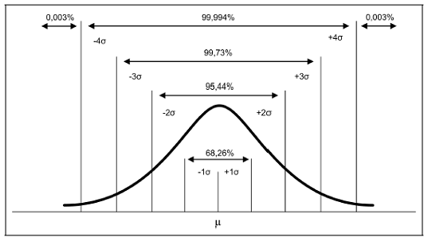
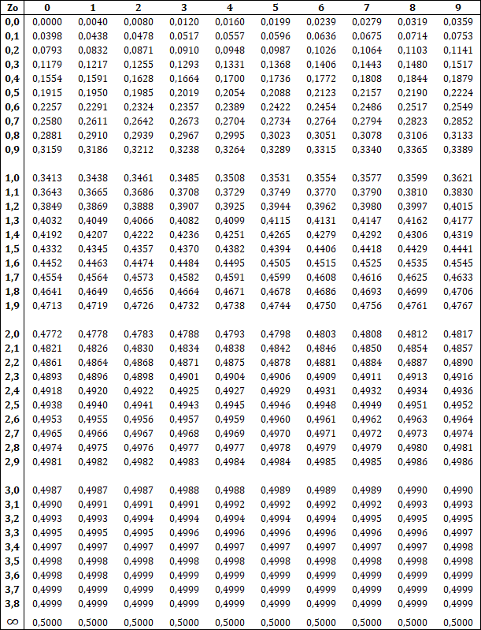

# Estatística

- Estatística é a ciência que se utiliza das teorias probabilísticas para explicar a frequência da ocorrência de eventos
- A estatística é uma coleção de métodos para planejar experimentos, obter dados e organizá-los, resumi-lo, analisá-los interpretá-los e deles extrair conclusões.

## Estatística Descritiva

- Organizar, demostrar e resumir os dados
    - Os **DADOS** são os registros soltos, aleatórios, sem quaisquer análise (Rezende, 2015).
    - A **INFORMAÇÃO** seria qualquer estruturação ou organização desses dados
    - O **CONHECIMENTO** é a informação processada e transformada em experiência pelo indivíduo. O conhecimento é a capacidade que, o processamento da informação adicionado ao repertório individual, nos dá, de agir e prever o resultado dessa ação. 
- A **Estatística Probabilística** visa analisar situações sujeitas ao acaso
- A **Estatística Inferencial** visa obter respostas sobre um fenômeno com dados representativos
- A **Estatística Descritiva**: envolve a organização e sumarização dos dados através de metodologias simples;

## Observações e Experimento

- **Observação**: Estudo em que os elementos analisados não são afetados (pesquisa)
- **Experimento**: Condições ou tratamentos são impostas aos grupo para avaliar o resultado
- **Grupo de teste** é a "cobaia"; o grupo que você vai inserir algo diferente pra observar o que acontece e, o **grupo de controle**, aquele no qual você vai se basear pra ver o que mudou.

# Variáveis 

## Quantitativas

- Consistem  em  números  que  representam  contagens  ou  medidas.  Divide-se em:
    - **Contínuas**: Valores reais, ou seja, podem assumir qualquer intervalo de valor. Ex: peso, altura. 
    - **Discretas**: Valores inteiros, fixos e definidos em um intervalo. Ex: Número de filhos.

## Qualitativas

- São os dados categóricos que podem ser separados em diferentes categorias ou atributos, que se distinguem por alguma característica não numérica. Divide-se em:
    - **Nominais**: Categorias SEM hierarquia
    - **Ordinais**: Categorias COM hierarquia

# EDA - Análise Exploratória de Dados

- Busca obter informações ocultas sobre os dados
- Variação, anomalias, distribuições, tendências, padrões e relações dos dados.
- Iniciar uma análise de dados pela EDA, só então decidir buscar a solução para o problema
- EDA faz parte do pipeline de qualquer processe de análise de dados, mesmo que informal

# Amostras

- Uma **população** é um conjunto de pessoas, itens ou eventos sobre os quais você quer fazer inferências. Nem sempre é conveniente ou possível examinar todos os membros de uma população inteira, por isso devemos selecionar uma amostra.
- Uma **Amostra** é um subconjunto de pessoas, itens ou eventos de uma população maior que você coleta e analisa para fazer inferências. Para representar a população bem, uma amostra deve ser coletada aleatoriamente e ser adequadamente grande.
    - Se a amostra é aleatória e grande o suficiente, você pode usar as informações coletadas a partir da amostra para fazer inferências sobre a população.
    - Se ela não representa a população, dizemos que ele é enviesada
    - Amostras diferentes podem representar resultados diferentes
 - Uma pesquisa com toda a população pode ser caro, por isso são usadas as amostras

## Amostragem aleatória simples

Também conhecida por amostragem ocasional, acidental, casual, randômica, etc. A amostragem simples ao  acaso  destaca-se  por  ser  um  processo  de  seleção  bastante  fácil  e  muito  usado.  Neste  processo,  todos  os  elementos da população têm **igual probabilidade** de serem escolhidos, desde o início até completo processo de coleta.

- Um determinado número de elementos é retirado da população de forma aleatória
- Todos os elementos da população alvo do processo de amostragem, devem ter as mesmas chances de serem selecionados para fazer parte da amostra
- **com reposição**, ou seja, o elemento escolhido pode ser escolhido novamente
- **Sem reposição**, ou seja, o elemento escolhido não pode ser escolhido novamente

## Amostras Estratificada

No  caso  de  possuir  uma  população  com  uma  certa  característica  heterogênea,  na  qual  podemos  
distinguir  subpopulações  mais  ou  menos  homogêneas,  denominadas  de  estratos,  podemos  usar  a  amostragem  
estratificada. 

- As vezes as populações estão divididas nos chamados estratos, onde os estratos são mutuamente exclusivos.
- Selecionamos elementos proporcionalmente de acordo com a categoria, para que uma não tenha mais que outras

## Amosta Sistemática

Trata-se de uma variação da amostragem simples ao acaso, muito conveniente quando a população está **naturalmente  ordenada**,  como  fichas  em  um  fichário,  listas  telefônicas  etc.  Requer  uma  lista  dos  itens  da  população, e, assim, padece das mesmas restrições já mencionadas na aleatória ao acaso. Se os itens da lista não se apresentarem numa ordem determinada à amostragem Sistemática pode dar uma amostra realmente aleatória.

- O primeiro elemento é escolhido aleatoriamente, e a cada N elementos um novo elemento é escolhido.
- Ex. Seja N = 500, n = 50.  Então a = 500/50 = 10. Sorteia-se um número de 1 a 10. Seja 3 (x = 3) o número sorteado. Logo, os elementos numerados por 3; 13; 23; 33; ... serão os componentes da amostra. 

# Tabelas

- Tabela é uma maneira de apresentar de forma resumida um conjunto de dados
- TÍTULO DA TABELA
    - Conjunto de informações, as mais completas possíveis, respondendo às perguntas: O que?, Quando? e  Onde?, Localizado no topo da tabela, além de conter a palavra “TABELA” e sua respectiva numeração. 
-  CORPO DA TABELA: É o conjunto de Linhas e Colunas que contém informações sobre a variável em estudo. 
    1. Cabeçalho da Coluna – Parte superior da tabela que especifica o conteúdo das colunas; 
    2. Coluna Indicadora – Parte da tabela que especifica o conteúdo das linhas; 
    3. Linhas – retas imaginárias que facilitam a leitura, no sentido horizontal, de dados que se inscrevem nos seus cruzamentos com as linhas; 
    4. Casa ou Célula – espaço destinado a um só número; 
    5. Total – deve ser SEMPRE destacado de alguma forma; 
    6. Laterais da tabela – não devem ser fechadas. Caso as feche, passa a ser chamada de “QUADRO”. 
    7. Número – preferencialmente utilizar separador de 1000 (por exemplo: 1.854.985 ao invés de 1854985). 
- Há  ainda  a  considerar  os  elementos  complementares  da  tabela,  que  são  a  fonte,  as  notas,  e  as  chamadas, localizadas, de preferência, no rodapé. 
    - Fonte – identifica o responsável (pessoa física ou jurídica) ou responsável pelos dados numéricos; 
    - Notas –  é  o  texto  que  irá  esclarecer o conteúdo estudado,  que poderá ser de caráter geral ou específico de uma tabela; 
    - Chamadas  –  símbolo  remissivo  atribuído  a  algum  elemento  de  uma  tabela  que  necessita  de  uma  nota específica.  
- SINAL CONVENCIONAL: A substituição de uma informação da tabela poderá ser feita pelos sinais abaixo: 
    - \- dado numérico igual a zero; 
    - ...  Quando não temos os dados; 
    - ?   Quando temos dúvida na informação; 
    - 0 quando o valor for muito pequeno.

 # Séries
 
- Uma série estatística define-se como toda e qualquer coleção de dados estatísticos referidos a 
uma mesma ordem de classificação: QUANTITATIVA. Em um sentido mais amplo, SÉRIE é uma sequência de 
números que se refere a uma certa variável.  Caso estes números expressem dados estatísticos a série é chamada de série estatística. Em um sentido mais restrito, diz-se que uma série estatística é uma sucessão de dados estatísticos referidos a caracteres quantitativos. 
 
- Para diferenciar uma série estatística de outra, temos que levar em consideração três fatores: 
    - A **ÉPOCA** (fator temporal ou cronológico) a que se refere o fenômeno analisado; 
    - O **LOCAL** (fator espacial ou geográfico) onde o fenômeno acontece; 
    - O **FENÔMENO** (espécie do fator ou fator específico) que é descrito.

## Série Temporal
 
-  A  série  temporal,  igualmente  chamada  série  cronológica,  histórica,  evolutiva  ou  marcha, identifica-se pelo caráter variável do fator cronológico. Assim deve-se ter: 
- VARIÁVEL: a época 
- FIXO: o local e o fenômeno 
 
## SÉRIE GEOGRÁFICA 
 
- Também denominadas séries territoriais, espaciais ou de localização, esta série apresenta como elemento ou caráter variável somente o fator local. Assim: 
- VARIÁVEL: o local 
- FIXO: a época e o fenômeno 
 
## SÉRIE ESPECÍFICA 
 
- A série específica recebe também outras denominações tais como série categórica ou série por categoria. Agora o caráter variável é o fenômeno. 
- VARIÁVEL: o fenômeno 
- FIXO: a época e o local

# Distribuição de Frequências

- É uma agrupamento de dados em classes ou categorias, de tal forma que contabilizamos o número de ocorrências em cada classe.
- **Dados Brutos** -  O conjunto dos dados numéricos obtidos após a crítica dos valores coletados constitui-se nos dados brutos.
- **ROL**: É o arranjo dos dados brutos em ordem de frequências crescente ou decrescente
- **Amplitude Total** - É a diferença entre o maior e o menor valor observado
- **Distribuição de Frequência** - É  o  arranjo  dos  valores  e  suas  respectivas  frequências
- **Frequência Absoluta ($F_i$)** - É o número de elementos de cada uma das categorias ou classes. É o número de vezes que o elemento aparece na amostra, ou o número de elementos pertencentes a uma classe.
- **Frequência Relativa** - É dada pelo quociente entre a Frequência Absoluta e o total de elementos da amostra
    - $\frac{fi}{n}$
- **Frequência Relativa Percentual** - É a frequência relativa multiplicada por 100
- **Frequência Acumulada** - É a soma das frequências da classe i com todas as frequências das classes anteriores

# Gráficos

- **Gráfico em Colunas** - Conjunto de retângulos dispostos verticalmente separados por um espaço. Geralmente usados para mostrar quantidade entre dados categóricos. 
- **Gráfico em barras** - Semelhante ao gráfico em colunas, porém os retângulos são dispostos horizontalmente.
- **Gráfico em setores** - (Ou gráfico de Pizza) É a representação através de um círculo, por meio de setores. Muito utilizado quando pretendemos comparar cada valor da série com o total - proporção
- **Gráfico em linhas** - Muito utilizado para representar dados temporais
- **Gráfico Polar/Radar** - Representação por meio de um polígono. Geralmente presta-se para apresentação de séries temporais 
- **Histogramas** - É a representação gráfica de uma distribuição de FREQUÊNCIA por meio de retângulos justapostos
- **Polígonos de frequência**: É a representação gráfica de uma distribuição por meio de um polígono.

 
# Medidas de Centralidade

- Encontrar uma “medida do meio” ou “tendência central”. As  medidas  de  posição,  também  chamada  de  medidas  de  tendência  central,  possuem  três  formas  diferentes para três situações distintas:

## Média Aritmética

- POPULACIONAL, representada letra grega $\mu$ 
- AMOSTRAL, representada por $\overline{X}$
- É a soma de todos os valores observados da variável derivada pelo número total de observações.
$$X = \frac{\sum_{k=1}^{n}x_i}{n}$$
- É o centro de gravidade, ou seja, representa o ponto de equilíbrio de um conjunto de dados.
- É uma estatística descritiva que deve ser usada com cuidado, pois a média é sensível a valores extremos (outliers), que são observações que se situam mais longe do centro
- **Média Ponderada**: É a média onde cada elemento possuí um peso diferente.
$$X = \frac{\sum_{k=1}^{n}x_i*f_i}{n}$$
- **É a medida mais adequada quando não há valores discrepantes ou aberrantes**

## Mediana

- É o valor que ocupa a posição central da série de observações de uma variável, em rol, dividindo o conjunto em duas partes iguais.
- A quantidade de valores inferiores a mediana é igual à quantidade de valores superiores a mesma. 
- Quantidade ímpar de valores
$$MD = x_{\frac{n+1}{2}}$$
- Quantidade par de valores
$$MD = \frac{x_{\frac{n}{2}} + x_{\frac{n+1}{2}}}{2}$$
- Deve ser usada sempre que possível como medida representativa de distribuições com valores dispersos, como distribuições de rendas, folhas de pagamentos, etc.

## Moda

- É o valor que apresenta a maior frequência de variáveis entre os valores observados
- São os valores que mais se repetem dentre as observações
- Deve ser usado quando a distribuição dos dados é qual que as frequências são maiores nos extremos, onde a média e mediana são contraindicados 

# Medidas Separatrizes 

- Estas medidas são valores que ocupam posições no conjunto de dados, em rol (sequência), dividindo-o em partes iguais.
- **Quartis**: 4 partes de 25%. Ex: Se sua renda está no último quartil (75%), você ganha mais que 75% da população
- **Decis**: 10 partes de 10%. Ex: sua renda está no primeiro decil (10%), você ganha menos que 90% da população
- **Percentis**: 100 partes de 1%. Ex: Se sua renda está no último percentil (99%), você ganha mais que 99% da população

# Medidas de Dispersão

- As medidas de dispersão mostram o grau de afastamento dos valores observados em relação àquele valore representativo. 

## Amplitude Total

- É a diferença entre o maior e o menor valor observado
- Ele perde a informação dos valores do meio e não vê como os dados estão distribuídos

$$At = X_{max} - X_{min}$$

## Amplitude Interquatílica

- É a diferença entre o terceiro e o primeiro quartil.
- A medida abrange 50% dos dados
- É mais estável por desconsiderar os valores extremos
- é útil para detectar valores discrepantes

$$dq = Q3 - Q1$$

- **amplitude semi-interquatílica** - É a média aritmética da diferença entre a mediana e os quartis.

$$dq = \frac{Q3 - Q1}{2}$$

## Desvio Médio

- É a diferença entre cada valor observado e a média.

$$dm = \frac{\sum_{k=1}^{n}|x_i - X|*f_i}{n}$$

## Variância

- Mede a dispersão dos valores em torno da média.
- POPULACIONAL, representada letra grega $σ^2$  
- AMOSTRAL, representada por $S^2$
- Indica o "quão distantes" em geral os valores observados se encontram do valor esperado.

$$ \sigma^2 = \frac{\sum_{k=1}^{k}(x_i - X)^2*f_i}{n}$$

## Desvio Padrão

- Indica uma medida de dispersão dos dados em torno da média amostral
- POPULACIONAL, representada letra grega $σ$  
- AMOSTRAL, representada por $S$
- **Baixo Desvio** - Indica que os pontos dos dados tendem a estar próximos da média ou do valor esperado
- **Alto Desvio** - Indica qie os pontos dos dados estão espalhados em uma ampla gama de valores

$$ \sigma = \sqrt{\sigma^2}$$

## Coeficiente de Variação

- É uma medida útil para comparação de séries distintas
- É usado para avaliar a precisão de experimentos
- **Valores altos de CV indicam pequena representatividade da média**
- O CV é usado para avaliar qual amostra é mais homogênea (Possui menor variabilidade)
- Quando amostras possuem a mesma média, a conclusão pode ser feita a partir da comparação de suas variâncias
- Para amostras com médias diferentes, aquela que apresentar o menor CV será a mais homogênea

$$CV = \frac{\sigma}{X} * 100%$$

# Probabilidade

- É um conceito filosófico e matemático que permite quantificar a incerteza. 
- É a chance de algum evento ocorrer
- **Experimento Aleatório** - É todo experimento que produz resultados imprevisíveis, dentre os possíveis, mesmo quando repetidos em semelhantes condições
- **Espaço Amostral** - É o conjunto de todos os resultados possíveis de um determinado experimento aleatório.
- **Evento** - É todo o subconjunto do espaço amostral relacionado a um experimento aleatório. 
    - Evento Certo - É aquele evento que se igual ao espaço amostral S
    - Evento Impossível - É aquele evento que não possui elemento algum
- P = $\frac{Ocorrência Esperada}{Número de Eventos Possíveis}$
    - **Eventos Excludentes** (ou)- Quando os eventos não podem ocorrer ao mesmo tempo (1 ou par)
        -  Soma-se as Probabilidades
    - **Eventos Não Excludente** (ou) - Quando podem ocorrer ao mesmo tempo (2 ou par)
        - Soma-se as Probabilidades, mas diminui-se as sobreposições
    - **Eventos Dependentes** (e) - A ocorrência de um evento afeta o outro. Um tem que ocorrer para que depois que o outro ocorra. 
        - Multiplicação entre os eventos, mas diminui-se o espaço amostral
    - **Eventos Independentes** (e) - A ocorrência de um evento não afeta o outro
        - Multiplicação entre os eventos

# Passeio Aleatório

- Não é "Totalmente Aleatório"
- Existe uma distribuição de probabilidade

# Estocástico X Determinístico

- **Estocástico** - Dada uma mesma entrada, a saída pode variar
- **Determinístico** - Dada uma mesma entrada, a saída sempre será a mesma

# Distribuições

- Define o comportamento de dados Aleatórios

## Distribuição Normal (gaussiana)

- Cerca de 68% dos dados estão a um desvio padrão da média
- Cerca de 95% dos dados estão a dois desvios padrões da média
- Cerca de 99,7% dos dados estão a três desvios padrões da média

- Propriedades
    - A F.D.P da normal, f(x), é simétrica em relação a X = $\mu$, e ainda, a média = moda = mediana. 
    - f(x) possui um único ponto máximo para X = $\mu$, 
    - f(x) tem dois pontos de inflexão, cujas as abscissas valem x - $\mu$ e x + $\mu$
    - f(x) tende a zero quando x tende a infinito
    
### Distribuição Normal Padronizada

- A variável Normal padronizada é obtida por meio de uma transformação linear da variável normal X, obtendo-se assim uma escala relativa de valores na qual a média é tomada como ponto de referência e o desvio padrão como média de afastamento da média

$$Z = \frac{X - \mu}{\sigma}$$

- Sendo Z o valor da variável normal padronizada e X o valor da variável aleatória X, $\mu$ a média de x e $\sigma$ o desvio padrão de X, então
    - A média é zero
    - E o desvio padrão é 1. 
    - Z = -2 quer dizer que os dados estão a dois desvios padrões abaixo da média
- Devemos olhar para a tabela o valor de Z e encontrar o valor a probabilidade
- Probabilidades em que buscamos no lado direito devemos subtrair 1 pela a probabilidade (MAIS QUE)
- Quando o valor de Z tem mais de 2 casas decimais, devemos mudar a coluna de acordo com o valor da segunda casa, caso contrário, olhamos para a coluna 0.

### Teste de Hipótese - Shapiro

1. Formulação da Hipótese: 
    - H0: A amostra provém de uma população Normal 
    - H1: A amostra não provém de uma população Normal
2. Estabelecer o Nível de significância do teste (α), normalmente 0,05;
3. Calcular a estatística de teste:
    - Ordenar as n observações da amostra:  x(1), x(2), x(3), ..., x(n);
    - Calcular $\sum_{i = 1}^{n}{(x_i - X)}^2$
    - Calcular b
    - Calcular W.
4. Tomar a decisão: Rejeitar H0 ao nível de significância α se $W_{calculado}$ < Wα
    - p-value <= nível de significância, então não é normal
    - p-value <= nível de significância, então é normal 

## Distribuição T-Student

- Utilizada quando a amostra é pequena e não se conhece o desvio padrão da amostra
- Para amostrar grandes, ela tende a se comportar como uma distribuição normal, mas reflete a maior variabilidade (com curvas mais alargadas) que é de se esperar em amostras pequena
    - Quanto maior o grau de liberdade, mais a distribuição t de Student se aproxima da distribuição Normal.
- O grau de liberdade corresponde ao tamanho da amostra
- Calculamos o valor de T
$$t = \frac{\overline{X} - \mu}{\frac{s}{\sqrt{n}}} $$
- Consultamos a tabela de distribuição de T

## Distribuição de Bernoulli

- Ocorre quando consideramos uma única tentativa de um experimento aleatório, onde podemos ter sucesso ou fracasso nessa tentativa. 
- $p$ a probabilidade de sucesso
- $q$ a probabilidade de fracasso
- $x$ o número de sucesso em uma única tentativa
$$f(n) = \left \{ \begin{matrix} 0, & \mbox{ se for fracasso com P(x = 0) = q } \\ 1, & \mbox{se for sucesso, com p(x = 1) = p} \end{matrix} \right. $$
- Em todos os casos estamos interessados na ocorrência de sucesso ou fracasso. 
- A média = p 
- Variância = pq

## Distribuição Binomial

- Def: Seja x, o número de sucessos obtidos, na realização de n ensaios de Bernoulli independentemente. Diremos que x segue o modelo  Binominal com parâmetros n e p e sua função de probabilidade é dada por

$$\left(\begin{array}{c}n\\k\end{array}\right)=\frac{n!}{k!(n-k)!}$$

- Para ser uma DB, deve atender as condições
    1. São realizadas n repetições (tentativas) independentes
    2. Cada repetição ou tentativa é um ensaio de Bernoulli
    3. A probabilidade p de sucesso em cada ensaio é constante.
- A média = np
- A variância = npq

## Distribuição de Poisson

- Este tipo de distribuição é útil para descrever as probabilidades do número de ocorrências num campo ou intervalo contínuo.
- Def: Dizemos que Variável Aleatória X segue o modelo de Poisson com parâmetro $\lambda$ ($\lambda$ > 0) se sua fun;'ao de probabilidade é dada por
    $$\mathbb{P}(X=k)=\frac{e^{-\lambda}\lambda^k}{k!}.$$
    $$p(k)=\mathbb{P}(X=k)=\left(\begin{array}{c}n\\k\end{array}\right)p^k(1-p)^{n-k}.$$
- Parâmetro λ  indica a taxa de ocorrência por unidade medida (média da distribuição).
- média = λ e variância = λ 

## Estatística Paramétrica

- Requer que os dados estejam em conformidade com alguma distribuição
- Estatísticas não-paramétrica - Quando os dados não estão com conformidade com alguma distribuição, ou quando não se conhece a distribuição dos dados
- A estatística paramétrica oferece menos riscos, onde os testes de hipóteses tendem a ser mais precisos. 

## Teorema Central do Limite 

- Uma amostra grande, adequadamente escolhida, remeterá à população da qual foi retirada – Haverá variação de uma amostra  para outra, mas a probabilidade de que qualquer amostra se desvie enormemente da população é muito baixa. 
- **Erro Padrão**: O erro padrão é o desvio padrão das médias de amostras. 
    - Um erro padrão grande significa que as médias das amostras estão esparsamente espalhadas em torno da média da população
    - Um erro padrão pequeno significa que as médias das amostras estão relativamente aglomeradas em torno da média
    - ERRO PADRÃO = $s/sqtr(n)$
        - Onde s é o desvio padrão da população e n é o tamanho da amostra
    - Médias das amostras distribuídas Normalmente 
        - 68% das médias das amostras se situam dentro de um erro padrão em relação à média da população
        - 95% das médias das amostras se situam dentro de dois erros padrões em relação à média da população
        - 99,7% das médias das amostras se situam dentro de três erros padrões em relação à média da população

1. Se você obteve amostras grandes e representativas de qualquer população, as médias dessas amostras serão distribuídas normalmente em torno da média da população (independente da distribuição da população adjacente)
2. A maioria das médias de amostras estará razoavelmente perto da média da população. O erro padrão é que define "razoavelmente perto"
3. O teorema central do limite nos diz a probabilidade de que a média de uma amostra se situe dentro de certa distância da média da população. É relativamente improvável que uma média de amostras se situe a mais de dois erros padrões em relação à média da população, e bastante improvável que se situe a três ou mais erros padrões
4. Quanto menos provável for um resultado observado ao acaso, mais confiantes podemos estar em presumir que haja outro fator em jogo

# Intervalo de Confiança

- É possível inferir características de uma população a partir de uma amostra
    - Erro Padrão / Nível de confiança
    - Problemas: Dados ruins e possível enviesamento
- Intervalo de Confiança - O parâmetro mais ou menos a margem de erro
    - Parâmetro - valor a ser estimado
    - Margem de Erro - Variabilidade, para mais ou para menos
- Quanto maior o tamanho da amostra teremos menos erro padrão. 

# Teste de Hipóteses

- Visam confirmar ou negar uma premissa usando uma amostra
    - Esta premissa usa um parâmetro
    - Encontrar diferenças não é tudo, é preciso saber se esta afirmação é estatisticamente significativa
- $H0$ - Define-se por $H0$ a hipótese existente, chamada hipótese nula, a ser testada, onde inicialmente será tomada como verdadeira. É, basicamente, a negação do que o pesquisador deseja provar.
- $H1$ - Hipótese alternativa, que será aceita, se os dados mostrarem evidências suficientes para a rejeição da hipótese nula. É, basicamente, a hipótese da pesquisa. 
- Exemplo: Droga para prevenir malária
    - Hipótese Nula: nova droga não é mais efetiva em prevenir a malária do que um placebo
    - Hipótese Alternativa: nova droga pode ajudar a prevenir a malária
    - Dados: um grupo aleatório recebe a nova droga e um grupo de controle recebe placebo
    - Resultado: grupo que recebe a droga tem muito menos casos de malária que o grupo de controle
    - Resultado extremamente improvável se a droga não tivesse impacto medicinal. Por isso, rejeitamos a hipótese nula e aceitamos a alternativa. Ou seja, essa nova droga pode ajudar a prevenir malária.
    
    
- Muitas vezes, a hipótese nula é criada com a esperança de que seja rejeitada. Nesses exemplos, o “sucesso” da pesquisa envolvia rejeitar a hipótese nula.
    - Se a hipótese nula for verdadeira, qual é a probabilidade de observar esse padrão de dados por puro acaso?
    - Mas o quanto a hipótese nula deve ser implausível para podermos rejeitá-la e recorrer a alguma explicação alternativa?
        - 5% (0,05) é um dos limiares mais comuns, chamado de nível de significância.
        - Podemos rejeitar a hipótese nula no nível 0,05 se a chance de obter um resultado no mínimo tão extremo quanto o que observamos se a hipótese nula for verdadeira for **menor que 5%**.
- **Valor-p** ou **p-value**
    - Se pegarmos duas amostras grandes da mesma população, seria de esperar que tenham médias bastante similares, ou idênticas.Ou seja, a diferença entre as médias deve ser próxima de zero.
    - O teorema central do limite nos diz que a diferença entre duas médias estará distribuída aproximadamente como uma distribuição Normal
    - Se duas amostras provêm da mesma população, então, em cerca de 68 casos em 100, a diferença entre as médias estará dentro de um erro padrão de zero. E cerca de 95 casos em 100, a diferença estará dentro de dois erros padrões. E em 99,7 casos em 100, a diferença estará dentro de três erros padrões... (EX tamanho da cabeça em relação ao autismo)
    
- **Erro Padrão para uma diferença de médias**
    - O erro padrão é uma medida de variação de uma média amostral em relação à média da população. Sendo assim, é uma medida que ajuda a verificar a confiabilidade da média amostral calculada. Para obter uma estimativa do erro padrão, basta dividir o desvio padrão pela raiz quadrada do tamanho amostral. O resultado obtido também estará na mesma unidade de medida do valor amostral.
    - $(X - Y) / sqrt((Sx^2)/nx + (Sy^2)/ny) $
    
- Qual o melhor limiar para rejeitar uma hipótese nula?
    - **Erro Tipo I**: rejeitar equivocadamente uma hipótese nula (Falso Positivo)
        - Quanto maior o limiar, maiores as chances
        - Ex. Inocentes presos, drogas que não funcionam no mercado
    - **Erro Tipo II**: não rejeitar uma hipótese nula que deveria ser rejeitada (Falso Negativo)
        - Quanto menor o limiar, maiores as chances
        - Ex. Culpados soltos, drogas que funcionam fora do mercado
- O processo geral consiste em:
    1. Formular a hipótese nula e a Hipótese alternativa
    2. Especificar um nível de significância ($\alpha$)
    3. Escolher a estatística a usar e encontrar a sua distribuição de probabilidade son o pressuposto de $H0$ ser verdadeira. 
    4. Determinar a região de rejeição
    5. Calcular o valor de observações da estatística de teste.
    6. Decidir rejeitar H0 ou não rejeitar H0

## Teste de Hipótese para Médias Populacionais $\mu$

- Se $\sigma^2$ é conhecida então, distribuição Z.
$$Z=\frac{\overline{X}-\mu_0}{\frac{\sigma}{\sqrt{n}}}$$
- Se $\sigma^2$ é desconhecida então, distribuição T
$$T=\frac{\overline{X}-\mu_0}{\frac{s}{\sqrt{n}}}$$

1. Estabelecer as hipóteses:
    - Fixamos **H0: μ = μ0**. Dependendo da informação que fornece o problema que estamos estudando, a hipótese alternativa pode ter uma das três formas abaixo:
     - H1:μ≠μ0(teste bilateral)
     - H1:μ>μ0(teste unilateral à direita)
     - H1:μ<μ0(teste unilateral à esquerda)
2. Fixar o nível de significância **α**
3. Determinar a região crítica.
    - Se o teste é bilateral, determinamos os pontos críticos **−tα/2** e **tα/2** tais que P[T > tα/2] = P[T <−tα/2] = α/2 a partir da distribuição t de Student com n−1 graus de liberdade.
    - Se o teste é unilateral, determinamos o ponto crítico tα tal que P[T > tα]= α
    -  Se o teste é unilateral à esquerda, determinamos o ponto −tα tal que P[T < −tα]=α
4. Calcular, sob a hipótese nula, o valor: 
$$T_{\text{obs}}=\frac{\overline{x}-\mu_0}{\frac{s}{\sqrt{n}}}$$

    - onde
        - x: valor da média amostral.
        - μ0: valor da média populacional sob a hipótese nula.
        - s: valor do desvio padrão amostral.
        - n: tamanho da amostra.
5. Critério: 
    - Teste bilateral: se Tobs > tα/2 ou se Tobs < −t−α/2, rejeitamos H0. Caso contrário, não rejeitamos H0
    - Teste unilateral à direita: se Tobs >tα , rejeitamos H0. Caso contrário, não rejeitamos H0
    - Teste unilateral à esquerda: se Tobs < −tα, rejeitamos H0. Caso contrário, não rejeitamos H0
6. O p-valor
    - Se o teste bilateral é dado por p-valor=P[|t| > |Tobs||H0]=2P[T > |Tobs||H0].
    - Se o teste é unilateral à direita, o p-valor é dado por p-valor=P[T > Tobs|H0]
    - Se o teste é unilateral à esquerda, o p-valor é dado por p-valor=P[T < Tobs|H0].

7. O intervalo de confiança é dado por 
$$IC(μ,1−α)=(X¯¯¯¯−tα/2sn−−√;X¯¯¯¯+tα/2sn−−√)$$
- Se o teste é bilateral. Se o teste é unilateral à direita, então o intervalo de confiança para o parâmetro μ é dado por 
$$IC(\mu,1-\alpha)=\left(\overline{X}-t_{\alpha}\frac{s}{\sqrt{n}};\infty\right)$$
- Se o teste é unilateral à esquerda, então o intervalo de confiança para o parâmetro μ é dado por 
$$IC(\mu,1-\alpha)=\left(-\infty;\overline{X}+t_{\alpha}\frac{s}{\sqrt{n}}\right)$$
8. O Erro do tipo II é cometido ao aceitar H0 quando esta é falsa (H1 é verdadeira). 
     - P[erro do tipo II]=P[Aceitar H0|H1 é verdadeira]=β.

## Qui-Quadrado

-  O teste de independência Qui-Quadrado é usado para descobrir se existe uma associação entre a variável de linha e coluna variável em uma tabela de contingência construído à partir de dados da amostra.
- A hipótese nula é de que as variáveis não estão associadas, em outras palavras, eles são independentes. A hipótese alternativa é de que as variáveis estão associadas, ou dependentes. 
- Não se aplica se 20% das observações forem inferiores a 5
- Não pode haver frequências inferiores a 1; 
1. Determinar H0. Será a negativa da existência de diferenças entre a distribuição de frequência observada e a esperada;
2. Estabelecer o nível de significância (µ );
3. Determinar a região de rejeição de H0. Determinar o valor dos graus de liberdade (φ), sendo K – 1 (K = número de categorias). Encontrar portanto, o valor do Qui-quadrado tabelado;
4. Calcular o Qui Quadrado, através da fórmula:
$$Q^2_{obs}=\sum^r_{i=1}\sum^c_{j=1}\cfrac{(O_{ij}-E_{ij})^2}{E_{ij}}$$
5. O valor-p
$$\mbox{p-valor}=P[Q^2_{obs}\chi^2_{\alpha;(r-1)(c-1)}|H_0]$$
