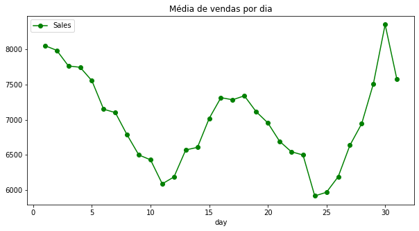
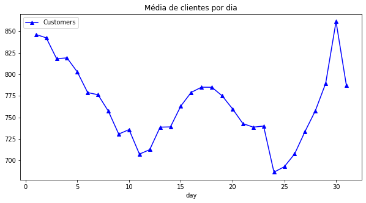
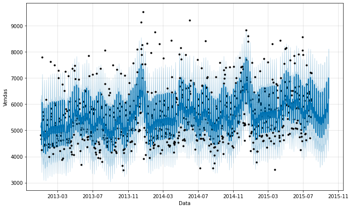

# Departamento de Recursos Humanos

Um projeto que analisa as séries temporais dos dados da competição [Rossmann Store Sales](https://www.kaggle.com/c/rossmann-store-sales/data/ibm-hr-analytics-attrition-dataset) no Kaggle e usa o Facebook Prophet para estimar o lucro de uma dada loja num período de tempos.

## Alguns gráficos

- Média de vendas por dia

- Média de clientes por dia

- Série temporal de uma dada loja, considerando um período futuro de 60 dias.

## Resultados (Em andamento)

Submissão para o Kaggle com as previsões.

## Bibliotecas

- Pandas
- Numpy 
- Seaborn 
- Facebook Prophet
