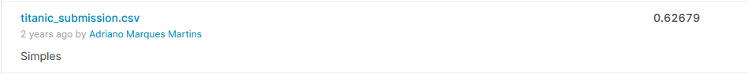
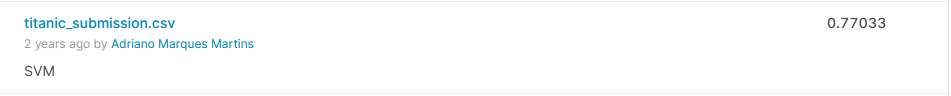
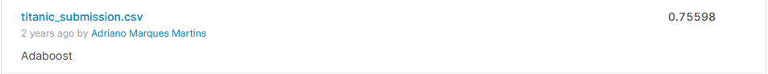
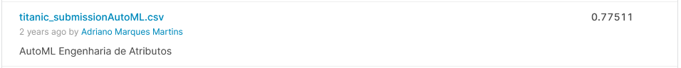
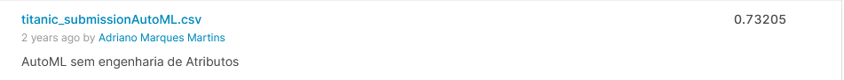

#  Titanic - Kaggle

Trabalho prático da disciplina optativa de Projeto de Software Orientado a Dados da 🏫 Universidade Federal de Viçosa - Campus Florestal. 

Este trabalho teve como objetivo aplicar diversas técnicas de exploração e engenharia de atributos para desenvolver um modelo capaz de prever as pessoas que iriam sobreviver aos naufrágio do Titanic. 

## 💻 Resultados 

A primeira submissão obteve um score de 0.62679 sem alteração nos atributos usando o **SVM**.



Houve uma significativa melhora apenas usando bins nos atributos Age e Fare, onde a melhor submissão chegou a 0.77033 usando o **SVM**.



Apesar deste trabalho abordar uma melhor utilização dos atributos, considerando titulos sociais ou setores das atuais cabines o melhor resultado alcançado foi de 0.75598 usando o AdaBoost. 



Quanto ao AutoML o mesmo foi aplicado de duas formas, a primeira utilizando os dados com a engenharia de atributos aplicado chagando a uma marca de 0.77511, 



Enquanto a segunda aplicação foi apenas os dados brutos, removendo apenas os atributos Name e Cabin, uma vez que o algoritmo não consegue tratar das strings não categorizadas, fazendo com que o algoritmo chegasse a um score máximo de 0.73205.



********************************************


## 🚀 Começando

Para obter uma cópia deste projeto:

```shell
git clone https://github.com/adrianomqsmts/Titanic-Kaggle
cd Titanic-Kaggle
```

## 🛠️ Construído com

Ferramentas, linguagens e outras tecnologias usadas no desenvolvimento deste sistema.

* [Kaggle-API](https://www.kaggle.com/docs/api) - API do Kaggle
* [Anaconda](https://www.anaconda.com/) - Ambiente de Desenvolvimento
* [JupyterLab](https://jupyter.org/documentation) - Ambiente de Desenvolvimento
* [Python3](https://docs.python.org/3/) - Linguagem de Programação
* [Seaborn](https://seaborn.pydata.org/tutorial.html) - Visualização de Dados
* [Pandas](https://pandas.pydata.org/docs/) - Biblioteca para Dados Estruturados e Análise de Dados
* [GridSearchCV](https://docs.python-requests.org/en/latest/) - Para ajuste de parâmetros
* ...

## ✒️ Autores

* **Desenvolvedor** - *Código e Documentação* - [Adriano](https://github.com/adrianomqsmts)


## 📄 Licença

Este projeto está sob a licença MIT License - veja o arquivo [LICENSE.md](https://github.com/adrianomqsmts/Titanic-Kaggle/blob/master/LICENSE) para detalhes.

---
