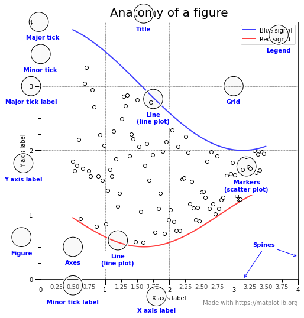
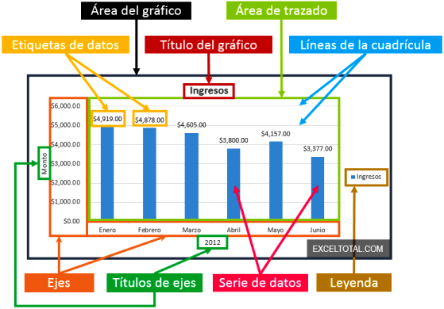

# Exploração de Dados

- Análise preliminar dos dados para entender melhor suas características
- Identificar o que precisa ser feito no pré-processamento
- Identificar as melhores ferramentas e técnicas para o pré-processamento
- Aproveitar habilidades humanas para reconhecer padrões
- **EDA** - Análise Exploratória de Dados

## Sumário Estatístico (Atributo Numérico)

- **Frequência de um atributo**: número de vezes ou percentual em que aparece no conjunto de dados
    - Ex. 48% das instâncias são de homens
- **Moda de um atributo**: valor mais frequente
- **Percentil**: o p-ésimo percentil xp indica que p% dos valores são menores que xp
    - Ex. o 20º  percentil indica que 20% dos valores estão abaixo dele, e 80% dos valores estão acima
- **Mediana**: 50º percentil
- **Média**: medida mais comum, mas sensível a outliers
- **Faixa**: diferença entre os valores mínimo e máximo
- **Variância/Desvio padrão**: medida de dispersão, ou seja, o quão próximos os valores estão entre si

## Visualização dos dados

- Converte dados em um formato visual para que as características e os relacionamentos entre os dados sejam explorados
- Facilidade para humanos analisarem informação visualmente
- Permite a detecção de padrões e tendências
- Permite a detecção de outliers e padrões incomuns
- Comunicação de dados de forma efetiva
- Objetos, seus atributos e as relações entre os objetos são traduzidos em elementos gráficos, tais como pontos, linhas, formas e cores
- Dois tipos de dados:
     - **Quantitativos: medem coisas**
     - **Categóricos: subdividem coisas em grupos úteis**
- Informações quantitativas sempre envolvem relacionamentos
    - Simples: entre valores quantitativos e categóricos
    - Complexos: entre conjuntos de valores quantitativos
- Relacionamentos *Quantitativo*/**Categórico**
    - *Estoque de um produto* por **região geográfica**
    - *Receita de vendas* por **intervalo de tempo**
- Relacionamentos *Quantitativo/Quantitativo*
    - *Valor gasto em marketing* relacionado ao *número de pedidos recebidos*

## Tabelas 

- **Quando usar tabelas?**
    - Consulta de valores individuais
    - Comparação de valores individuais
    - Valores precisos são necessários

- **Colunas ou Linhas?**
    - Quantas subdivisões cada categoria contém?
        - Se são poucas subdivisões: colunas
        - Se são muitas subdivisões: linhas
    - Qual o número máximo de caracteres por subdivisão?
        - Se alguma subdivisão possui texto longo, organizar em linhas
     - Algumas subdivisões envolvem séries temporais ou rankings?
        - Séries temporais: colunas
        - Ranking: linhas        
- **Uso do espaço em branco**
     - Os espaços podem ser manipulados para direcionar os olhos do leitor entre linhas e colunas
    - Se deseja que o leitor avalie os dados coluna a coluna, privilegie o espaço entre colunas em detrimento do espaço entre linhas
    - Se deseja que o leitor avalie os dados linha a linha, faça o oposto    
- **Grids e linhas**
    - Delimitar linhas e colunas
    - Agrupar subconjuntos de dados
    - Ressaltar subconjuntos de dados
- **cores**   
    - Uso de cores suaves para preenchimento do fundo é interessante para destaca
- **Orientação do texto**
    - Não há representação melhor que a da linguagem natural da esquerda para a direita
    - Há casos em que esta orientação não deve ser seguida, mas geralmente acontecem em gráficos e não em tabelas
- **Alinhamento**
    - Números que representem valores quantitativos devem ser alinhados à direita
    - Datas devem ser alinhadas à esquerda mantendo constante o número de dígitos
    - Texto que não expressa nem números nem datas, devem ser alinhados à esquerda
    - Quando o texto tem tamanho fixo e é pequeno, pode ser centralizado
    - Alinhar o cabeçalho juntamente com o conteúdo
    - Cabeçalhos de agrupamento devem ser centralizados
- **Dados**
    - **Números**
        - Não incluir informação desnecessária
        - Expressar a data de forma familiar aos usuários
        - Alinhar os dados de forma consistente
        - Colocar . (ou ,) a cada três dígitos (Ex.: 1.455.038 ao invés de 1455038
        - Truncar a exibição de 3 dígitos para milhar, milhão, bilhão
        - Usar o sinal de negativo ou parênteses para indicar números negativos
        - Colocar o sinal de % em todo valor percentual.
    - **Datas**
        - Expresse meses no formato de dois dígitos (01, 02,         …) ou três caracteres (jan, fev, …)
        - Expresse dias usando o formato de dois dígitos
        - Exclua porções da data que não sejam necessárias         no contexto
        - Atenção: formato varia entre países
        - EUA: mês antes do dia
        - Europa/Brasil: dia antes do mês
    - **Fontes**
        - Devem ser legíveis
        - Padrão em toda a tabela
        - Com ou sem serifa (linha ou curva no extremo das letras)

## Capacidade de Percepção

- Posição em escala comum
- Posição em escala não alinhada
- Comprimento, direção e ângulo
- Área
- Volume e Curvatura
- Sombreamento e Saturação

## Gráficos

- Mostra a relação entre duas variáveis
- Os gráficos revelam a forma dos dados
- Permitem a detecção de inúmeros pontos de interesse
- Permitem a comparação de valores, identificação de similaridades e diferenças
- Mostram relacionamentos entre diversos atributos, dando a eles formas
- O **objetivo** é revelar relacionamentos entre múltiplos valores

### Gráfico de Pontos
- Valores numéricos ao longo dos eixos X e Y
- Valores dos atributos determinam a posição
- 2D mais comuns
    - Atributos adicionais podem ser exibidos usando o tamanho, forma ou cor dos marcadores
- Formato, tamanho e cores dos pontos
- Aumente os pontos e escolha marcadores distintos
- Faça os pontos se destacarem com relação às linhas
- Arranjo de gráficos de pontos

### Gráfico de Barras

- Usado para dados Discretos
- Mostrar diferença entre valores para uma ou mais categorias
- **Barras horizontais**
    - Relacionamento de ranking
    - Rótulos das categorias não cabem na vertical
- **Proximidade**
    - Manter a razão entre a largura das barras e o espaçamento entre 1:1,5 e 1:0,5
    - Uma exceção ocorre quando as barras representam subdivisões categóricas. Nesse caso, o espaço não é necessário
    - Nunca sobreponha barras ..exceto quando quiser analisar correlações
- **Bordas** só agregam valor para destacar uma barra

### Histograma

- Tipo especial de gráfico de barras
- Mostra a distribuição de valores de uma **variável única**
- Divide os valores em caixas/bins e mostram um gráfico em barras do número de objetos em cada caixa/bin
- A altura da barra indica o número de objetos ou a frequência relativa

### Gráficos de Setores (Pizza)

- Usado para dados Discretos
- Mostrar diferença entre valores para uma ou mais categorias
- Usado com poucas categorias
- Pouca precisão
- Valores não muito próximos

### Gráfico de Linhas

- Representar tendências ou relacionamento com tempo
- Dados contínuos
- Mostra a Evolução
- Útil para Séries Temporais, com tempo no eixo horizontal e dimensões na vertical
- Suporta múltiplas categorias (várias linhas)

### Box Plot

- Mostra de forma consolidada a distribuição dos dados
- Podem ser usados para comparar atributos

### Hitmap e Treemaps

- Usados para comprar duas variáveis categóricas

### Escalas

- São usadas para melhorar a visualização dos gráficos onde ocorrem dados elevados ou dispersos. 
- Escala comum
- Escala logarítmica: logaritmo é a potência a qual o número, chamado base, precisa ser elevado para ser igual ao número

## Boas Práticas

1. Está usando o elemento Gráfico adequado?
2. Não há excessos de elementos decorativos?
3. Não há mais do que 7 elementos no Dashboard?
4. Os dados estão no contexto correto?
5. Dados não apresentação excessos de detalhes?
6. Os dados mais importantes estão destacados?
7. Não há mais do que 20 instâncias (linhas) por elemento (gráfico)?
8. Existe excesso de elementos não relacionados aos dados?
9. Não transcende as dimensões de uma tabela?
10. Não utiliza medidas ineficientes?
11. Existe um único assunto no Dashboard?
12. Está mantida a proporção 1/6 entre os eixos?
13. Exitem referencias de comparação?
14. Foi considerado o ranking de percepção do cérebro?
15. As cores são suaves?
16. Foram evitadas linhas de grade e moiré vibration?
17. Foram feitas considerações sobre o daltonismo?

