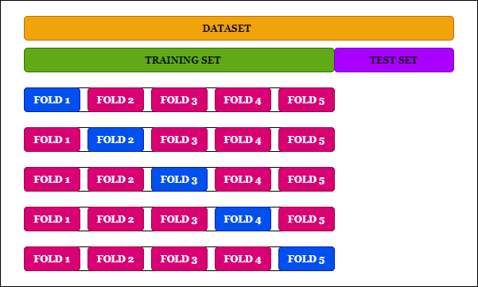

# Resumo 

- **Atenção: nunca utilize para teste os mesmos dados usados para treinamento**
-  Sub-conjunto de teste pode estar tendencioso
- Com uma matriz de confusão podemos saber qual classe o algoritmo tem maior acerto e maior erro
    - Em casos de classes, cujo o classificador tem baixas taxas de acerto, podemos fazer uma análise caso a caso, o do porquê o algoritmo está errando muito. 
- **Solução: Validação Cruzada**
    - Separar os dados D em K sub-conjuntos de aproximadamente mesmo tamanho
    - Para cada sub-conjunto D’, utilize os outros D – D’ para treinar o modelo e D’ para testar
    - Faça a média dos K resultados
    - Quantos sub-conjuntos K?
        - Usualmente, os dados são divididos em 10 sub-conjuntos: 10-fold-cross-validation

# Sub-conjunto de teste

- **Atenção: nunca utilize para teste os mesmos dados usados para treinamento**
- **Dados de treino** - são os dados que serão apresentados ao algoritmo de machine learning para criação do modelo. Estes dados costumam representar cerca de 70% da totalidade dos dados.
- **Dados de Teste** - Serão apresentados ao modelo após a sua criação, simulando previsões reais que o modelo realizará, permitindo assim que o desempenho real seja verificado. Estes dados costumam representar cerca de 30% da totalidade dos dados.

- Os dados de Treino e  devem ser escolhidos aleatoriamente, mas como escolhê-los de tal forma que não se repitam em ambos os conjuntos?

#  Validação Cruzada

- Validação-Cruzada é conhecida de K-Fold, onde:
    - K — Significa o número de subdivisões (iguais) que nós fizemos: No nosso caso K = 5;
    - Fold — Significa cada um dos blocos de cada K.
    
    
    
- Separar os dados D em K sub-conjuntos de aproximadamente mesmo tamanho
- Para cada sub-conjunto D’, utilize os outros D – D’ para treinar o modelo e D’ para testar
- Faça a média dos K resultados

- Quantos sub-conjuntos K?
    - **Usualmente, os dados são divididos em 10 sub-conjuntos: 10-fold-cross-validation**
- Ele retorna os **scores** de cada subdivisão, ou seja, quão performático cada uma é
    - Isso é interessante para comparar a performance de vários modelos e ver qual é mais performático
- Pensando bem, nós devemos ter sempre muita cautela quando aplicarmos essa abordagem. Isso, porque dependendo do nosso dataset o **custo computacional pode ser muito grande** já que nós vamos treinar o mesmo modelo em várias subdivisões
    
FONTE [Introdução a Validação-Cruzada: K-Fold](https://drigols.medium.com/introdu%C3%A7%C3%A3o-a-valida%C3%A7%C3%A3o-cruzada-k-fold-2a6bced32a90)

# Validando o modelo de aprendizado

- Ao se gerar um modelo de classificação, espera-se que ele classifique corretamente as entradas desconhecidas. Porém, às vezes na prática o modelo pode classificar equivocadamente

## Matriz de Confusão

- Uma **matriz de confusão** é um tabela que mostra as frequências de classificação para cada classe do modelo.
- A matriz condensa os resultados para facilitar a validação do modelo
    1. **Verdadeiro positivo (true positive — TP)**: ocorre quando no conjunto real, a classe que estamos buscando foi prevista corretamente. 
        - Exs: Mensagem é um Spam e o modelo a classifica como Spam, ou quando a mulher está grávida e o modelo previu corretamente que ela está grávida
    2. **Falso positivo (false positive — FP)**: ocorre quando no conjunto real, a classe que estamos buscando prever foi prevista incorretamente. 
        - Exs: Mensagem não é Spam e o modelo a classifica como Spam, ou a mulher não está grávida, mas o modelo disse que ela está.
    3. **Falso negativo (false negative — FN):** ocorre quando no conjunto real, a classe que não estamos buscando prever foi prevista incorretamente. 
        - Exs: Mensagem é Spam e o modelo a classifica como não Spam, ou quando a mulher está grávida e o modelo previu incorretamente que ela não está grávida.
    4. **Verdadeiro Negativo (true negative — TN):** ocorre quando no conjunto real, a classe que não estamos buscando prever foi prevista corretamente. 
         - Exs: Mensagem não é Spam e o modelo a classifica como não Spam, ou a mulher não estava grávida, e o modelo previu corretamente que ela não está.

### Acurácia

- Diz quanto o meu modelo acertou das previsões possíveis

$$accuracy = \frac{TP + TN}{TP + FP + TN + FN} = \frac{Acertos}{Acertos + Erros}$$

### Precisão

- Daqueles classificados como corretos, quantos realmente são corretos?
- Qual a proporção de identificações positivas foi realmente correta? Em outras palavras, o qual bem meu modelo trabalhou.

$$ precision = \frac{TP}{TP + FP} = \frac{Acertos Positivos}{Acertos Positivos + Erros}$$

### Revogação (Recall)

- Das entradas de classe X, quantos foram classificados realmente como X? 
- Em outras palavras, quão bom meu modelo é para prever positivo

$$recall = \frac{TP}{TP + FN} = \frac{Acertos Positivos}{Acertos Positivos + Falsos Negativos}$$

### F-score

- **Precisão x Revogação**
    - Ideal 100% para ambos
    - Buscar equilíbrio: VP x FP
    - Aumentar o recall tende a 'relaxar' o algoritmo e diminuir a precisão
    - Aumentar a 'rigidez' do algoritmo tende a aumentar a precisão e diminuir o recall   
- Já o f-score nos mostra o balanço entre a precisão e o recall de nosso modelo

$$f-score = 2 * \frac{precision * recalll}{precision + recall}$$

### Resumo

- **Acurácia**: indica uma performance geral do modelo. Dentre todas as classificações, quantas o modelo classificou corretamente;
- **Precisão**: dentre todas as classificações de classe Positivo que o modelo fez, quantas estão corretas;
- **Recall/Revocação/Sensibilidade**: dentre todas as situações de classe Positivo como valor esperado, quantas estão corretas;
- **F1-Score**: média harmônica entre precisão e recall.

# Custo do modelo para o negócio

- É uma maneira de avaliar o quanto perdeu com o negocio. 
- Deve-se **somar o custo dos falsos positivos e falsos negativos** para ter a perda total do negócio. 
- Ex. Conceder crédito para maus pagadores (falso positivo) + Deixar de conceder crédito para bons pagadores (falso negativo). 

# Underfitting X Overfitting

- **underfitting** - Resultados Ruins na base de treinamento
- **overfitting**
    - Resultados bons na base de treinamento
    - Resultados ruins na base de teste
    - Falta de Generalização, causando erros na classificação de novas instâncias