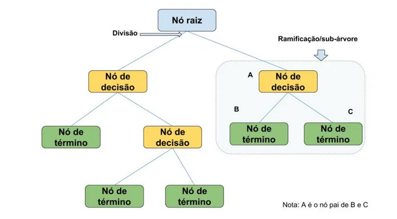
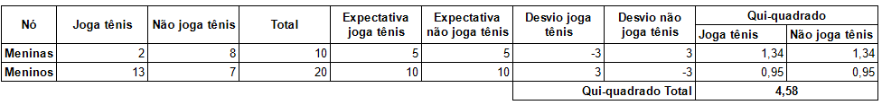
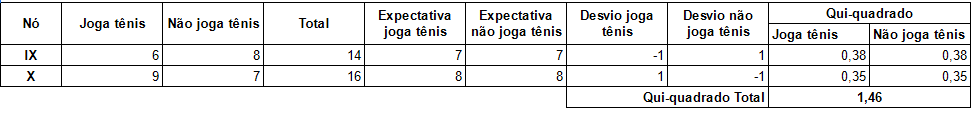
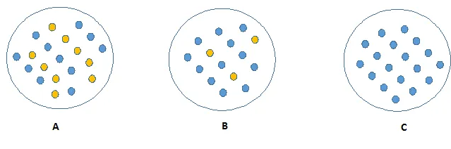
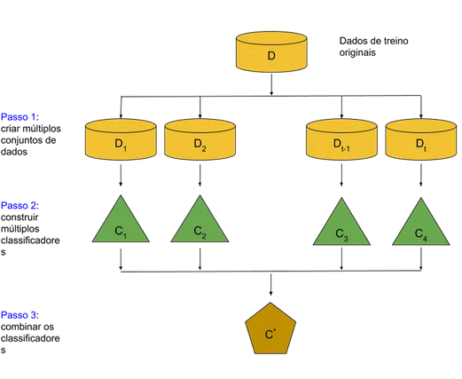

# Resumo

- A função de classificação aprendida é representada por uma árvore de decisão
    - Regras **SE-ENTÃO**
- Aplicações: diagnóstico médico, análise de risco de crédito, etc
- Cada nó especifica o teste de algum atributo da instância
- Cada ramo partindo de um nó corresponde a um dos valores possíveis dos atributos
- Começa pela pergunta:
    - Qual atributo deve ser testado na raiz?
        - Cada atributo é testado para avaliar o quão bem classifica sozinho os exemplos de treinamento
    - Processo se repete até que a árvore esteja completa
        - Abordagem gulosa
- **Quando considerar**:
    - Instâncias são descritas por um conjunto fixo de atributos (Ex. temperatura) e seus valores (ex. quente, morno, frio)
    - A classe é discreta com dois (ex. sim ou não), ou mais possibilidades (ex. risco alto, moderado, médio)
- **Características**
    - Simplicidade para compreensão e interpretação
    - Não necessita normalização dos dados
    - Atributos numéricos e categóricos
    - Bom desempenho e robustez
    - Solução ótima é NP-Completo
        - Heurísticas são utilizadas
    - Pode necessitar de mecanismos de poda para generalizar melhor
    

# Aprendizagem por Árvores

- A **Árvore de Decisão** é um tipo de algoritmo de aprendizagem de máquina supervisionado que se baseia na ideia de divisão dos dados em grupos homogêneos, podem ser utilizadas em um cenário de classificação ou regressão
- **Termologias**
    - **nó raiz**: Representa a população inteira ou amostra, sendo ainda dividido em dois ou mais conjuntos homogêneos
        - É o atributo que melhor divide o conjunto de dados.
    - **Divisão**: É o processo de dividir um nó em dois ou mais sub-nós
    - **Nós de decisão**: Quando um sub-nó é dividido em sub-nós adicionais. 
        - São representadas pelas condições lógicas (IF/ELSE) que determinam o caminho dentro da árvore
    - **Branch/Sub-árvore/Ramificação**: Uma sub-seção da árvore inteira é chamada de ramificação ou sub-árvore.
        - São pequenas árvores no meio do caminho a partir do nó de decisão
    - **Nó terminal/folha**: Os nós não divididos são chamados Folha ou Nó de Término..
        - Estão na parte inferior da árvore e como já foi dito podem conter uma classe ou um valor contínuo.
    - **Nó pai e nó filho**:  Um nó que é dividido em sub-nós é chamado de nó pai. Os sub-nós são os nós filhos do nó pai

- Funciona simplesmente percorrendo a árvore de acordo com a decição de cada nó
    - As folhas são os rótulos de classificação
    - Quanto mais no topo da árvore mais importante o atributo é para a classificação
    - **Matemática** - Entropia e Gain(S,A) 
        - ganho de informação (A importancia do atributo na base de dados) a mais alta define a raiz.
            - Após isso, devemos repetir todos os cálculos novamente desconsiderando os já selecionados e ir preenchendo a arvore.
     - Podemos também fazer sucessivas divisões nos atributos em um valor, onde podemos escolher uma ou outra classe.
- **Poda da árvore** - Limpa a árvore para remover atributos que tem pouca influência na classificação.
    - O processo de remover sub-nós de um nó de decisão é chamado poda. Podemos dizer que é o processo oposto ao de divisão
    -  A poda é uma das técnicas usadas **para lidar com o sobre-ajuste**
- **bias - viés** 
    - Erros por classificação errada
    - O quanto em média os valores previstos são diferentes dos valores reais. 
- **Variância**
    - Erros por sensibilidade pequena a mudanças na base de treinamento
    - O quão diferentes serão as previsões do modelo num mesmo ponto se diferentes amostras forem tomadas da mesma população
    - Pode levar a overfitting (acontece quando um algorítimo fica viciado aos dados (pouca variedade, decora as resposta, nao aprende, mas acerta os casos de teste))
- **Vantagens**
    - **Fácil interpretação**, pois não requer nenhum conhecimento estatístico para a sua interpretação. 
        - Sua representação gráfica é muito intuitiva e permite relacionar as hipóteses também facilmente.
    - **Menor necessidade de limpar dados**: Não precisa de normalização ou padronização, diminuindo a necessidade da limpeza de dados em comparação com outros modelos.
     - **Não é restrito por tipos de dados**: Pode manipular variáveis numéricas e categóricas.
    - **Útil em exploração de dados**: A árvore de decisão é uma das formas mais rápidas de identificar as variáveis mais significativas e a relação entre duas ou mais variáveis. Com a ajuda de árvores de decisão, podemos criar novas variáveis/características que tenham melhores condições de predizer a variável alvo. 
    - Rápido para novas classificações
- **Desvantagens**
    - Pode gerar árvores complexas (overfotting), pois as árvores se ajustar muito aos dados de treino e não ter uma performance muito boa com os dados de teste
    - São instáveis, pequenas alterações nos dados de treino produzem novas árvores
    - **Não adequado para variáveis contínuas**: ao trabalhar com variáveis numéricas contínuas, a árvore de decisão perde informações quando categoriza variáveis em diferentes categorias.
    - Problema NP-completo para construir a árvore
    
    
    
- **FONTES [Um tutorial completo sobre modelagem baseada em árvores de decisão (códigos R e Python)](https://www.vooo.pro/insights/um-tutorial-completo-sobre-a-modelagem-baseada-em-tree-arvore-do-zero-em-r-python/) e [Árvores de Decisão (Projeto passo a passo)](https://minerandodados.com.br/arvores-de-decisao-conceitos-e-aplicacoes/)**

# Como evitar o overfitting?

- Algumas estratégias que podemos adotar para ajudar a evitar o overfitting:
    1. Especificar o número mínimo de amostras para divisão do nó. Valores altos previnem a criação de modelos complexos ou podem causar underfitting.
    2. Especificar o número mínimo de amostras para o nível folha. Nos permite controlar o crescimento da árvore e deve ser considerado em cenários com dados desbalanceados.
    3. Profundidade máxima da árvore.
    4. Número máximo de features para considerar durante a divisão. 

## Índice Gini

- O índice Gini diz que se selecionarmos aleatoriamente dois itens de uma população, então ambos devem ser da mesma classe e a probabilidade disto é 1 (100%) se a população for pura.
    1. Funciona com a variável alvo categórica “Sucesso” ou “Falha”
    2. Executa apenas divisões binárias
    3. Quanto maior o valor de Gini, maior a homogeneidade
    4. O CART (Árvore de Classificação e Regressão) usa o método Gini para criar divisões binárias
- Passos para calcular o Gini de uma divisão:
    - Cálculo do Gini para sub-nós, calcule a soma dos quadrados da probabilidade de sucesso e e da de fracasso $(p^2 + q^2)$
    - Calcule o Gini para a divisão, use a pontuação de Gini ponderada de cada nó dessa divisão

### Exemplo Gini

Digamos que uma amostra de 30 alunos tem três variáveis: Sexo (menino ou menina), Classe (IX ou X) e Altura (160 cm a 180 cm). Digamos também que 15 destes 30 jogam tênis no recreio. A partir disso, como podemos criar um modelo para prever quem vai jogar tênis durante o recreio? Neste problema, precisamos segregar os alunos que jogam tênis no recreio com base nas três variáveis à nossa disposição.

vamos usar exemplo usado acima, onde queremos separar os alunos com base na variável alvo (jogam tênis ou não). No quadro abaixo, dividimos a população usando duas variáveis de entrada – Sexo e Classe. Agora, quero identificar qual divisão produz os sub-nós mais homogêneos usando o índice de Gini

- **Divisão por Sexo**
    - Gini para o sub-nó Feminino = $(0,2^2) + (0,8^2) = 0,68$
    - Gini para o sub-nó Masculino = $(0,65^2) + (0,35^2) = 0,55$
    - Gini ponderado da Divisão por Sexo = $\frac{10}{30} * 0,68 + \frac{20}{30} * 0,55 $= **0,59**
- **Divisão por Classe**
    - Gini para sub-nó Classe IX = $(0,43^2) + (0,57^2) = 0,51$
    - Gini para sub-nó Classe X = $(0,56^2) + (0,44^2) = 0,51$
    - Calcular o Gini ponderado para a classe dividida = $\frac{14}{30} * 0,51 + \frac{16}{30} * 0,51$ = **0,51**
- **Acima, vemos que a pontuação de Gini para a Divisão por Sexo é maior do que a Divisão por Classe. Logo, a divisão de nó acontecerá na Divisão por Sexo.**

## Qui-Quadrado

- É um algoritmo para descobrir a significância estatística entre as diferenças dos sub-nós e do nó pai. O qui-quadrado é medido pela soma dos quadrados das diferenças entre as frequências observadas e esperadas da variável alvo.
    1. Funciona com a variável alvo categórica “Sucesso” ou “Falha”.
    2. Pode executar duas ou mais divisões.
    3. Quanto maior o valor do qui-quadrado, maior é a significância estatística das diferenças entre sub-nó e nó pai.
    4. O qui-quadrado de cada nó é calculado usando a fórmula: 
        $$Qui-quadrado = \left(\frac{{Real – Esperado}^2}{Esperado}\right)^{\frac{1}{2}}$$
    5. Gera a árvore chamada de CHAID (Chi-square Automatic Interaction Detector)
- Passos para calcular o Qui-quadrado para uma divisão
    1. Calcule o qui-quadrado para o nó individual calculando o desvio para ambos Sucesso e Falha
    2. Calcule o qui-quadrado da divisão usando a soma de todos os qui-quadrados de Sucesso e Falha de cada nó da divisão

### Exemplo 

Digamos que uma amostra de 30 alunos tem três variáveis: Sexo (menino ou menina), Classe (IX ou X) e Altura (160 cm a 180 cm). Digamos também que 15 destes 30 jogam tênis no recreio. A partir disso, como podemos criar um modelo para prever quem vai jogar tênis durante o recreio? Neste problema, precisamos segregar os alunos que jogam tênis no recreio com base nas três variáveis à nossa disposição.

- **Divisão por Sexo**
    1. Primeiro vamos fazer o nó feminino. Preencha o valor real para “Joga tênis” e “Não joga tênis”. No caso, temos 2 e 8, respectivamente.
    2. Calcule o valor esperado de “Joga tênis” e “Não joga tênis”. Aqui seria 5 para ambos porque o nó pai tem probabilidade de 50% e aplicamos a mesma probabilidade na contagem de meninas (10).
    3. Calcule os desvios usando a fórmula (Real – Esperado). Para “Jogar tênis” é (2 – 5) = -3 e para “Não jogar tênis” é (8 – 5) = 3.
    4. Calcule o Qui-quadrado dos nós “Joga tênis” e “Não jogar tênis” usando a fórmula ((Real – Esperado) ^ 2 / Esperado) ^ (1 / 2). A tabela abaixo mostra o cálculo.
    5. Siga os mesmos passos para calcular o valor do Qui-quadrado do nó masculino.
    6. Por último, adicione todos os valores de Qui-quadrado para calcular o Qui-quadrado da Divisão por Sexo.
    

- **Divisão por Classe**
    - Execute os mesmos cálculos da divisão por Sexo e o resultado será o da tabela abaixo.
    
    

- **Na tabela acima, pode-se ver que o Qui-quadrado também identifica a Divisão por Sexo com mais significativa que a Divisão por Classe.**

# Ganho de Informação

- **A entropia é usada com a variável alvo categórica**.
- Podemos concluir que um nó menos impuro (**C**) requer menos informação para ser descrito
- Enquanto um nó mais impuro (**A**) requer mais informação
- A teoria da informação dá uma medida para definir esse grau de desorganização em sistema – **entropia**
- Se a amostra for completamente homogênea, então a entropia é zero. 
    - Se a amostra for dividida em partes iguais (50% – 50%), então terá entropia de um.
    $$Entropy = - p\log_2{p} - q\log_2{q}$$
- p e q são as probabilidades de sucesso e falha, respectivamente, para um dado nó
- É escolhida a divisão que tem a entropia mais baixa em comparação com o nó pai e com outras divisões. **Quanto menor for a entropia, melhor**.
- **Passos para calcular entropia de uma divisão**:
    - Calcule a entropia do nó pai
    - Calcule a entropia de cada nó individual e calcule a média ponderada de todos os sub-nós disponíveis na divisão

## Exemplo 

Digamos que uma amostra de 30 alunos tem três variáveis: Sexo (menino ou menina), Classe (IX ou X) e Altura (160 cm a 180 cm). Digamos também que 15 destes 30 jogam tênis no recreio. A partir disso, como podemos criar um modelo para prever quem vai jogar tênis durante o recreio? Neste problema, precisamos segregar os alunos que jogam tênis no recreio com base nas três variáveis à nossa disposição.

1. Entropia para o nó pai: – (15/30) log2 (15/30) – (15/30) log2 (15/30) = 1. (Isso mostra que é um nó impuro.)
2. Entropia para o nó feminino: – (2/10) log2 (2/10) – (8/10) log2 (8/10) = 0,72. E para o nó masculino: – (13/20) log2 (13/20) – (7/20) log2 (7/20) = 0,93
3. Entropia para a Divisão por Sexo: entropia ponderada de sub-nós: (10/30) * 0,72 + (20/30) * 0,93 = 0,86
4. Entropia para o nó Classe IX: (6/14) log2 (8/14) log2 (8/14) = 0,99. E para o nó da Classe X: – (9/16) log2 (9/16) – (7/16) log2 (7/16) = 0,99.
5. Entropia para a Divisão por Classe: (14/30) * 0,99 + (16/30) * 0,99 = 0,99
- **Acima, você pode ver que entropia da Divisão por Sexo é a mais baixa de todas, então a árvore vai ser dividida por sexo. Podemos derivar o ganho de informação da entropia como 1- Entropia.**

# Redução de Variância

- **A redução na variância é um algoritmo usado para variáveis alvo contínuas (problemas de regressão)**.
- Este algoritmo utiliza a fórmula padrão de variância para escolher a melhor divisão. A divisão com menor variância é selecionada como critério para dividir a população
$$ \sigma^2 = \frac{\sum_{k=1}^{k}(x_i - X)^2*f_i}{n}$$
- Na fórmula acima, X-barra é a média dos valores, X é o real e n é o número de valores.

- **Passos para calcular a variância**
    1. Calcule a variância para cada nó
    2. Calcule a variância para cada divisão como média ponderada de cada variância do nó

## Exemplo 
Digamos que uma amostra de 30 alunos tem três variáveis: Sexo (menino ou menina), Classe (IX ou X) e Altura (160 cm a 180 cm). Digamos também que 15 destes 30 jogam tênis no recreio. A partir disso, como podemos criar um modelo para prever quem vai jogar tênis durante o recreio? Neste problema, precisamos segregar os alunos que jogam tênis no recreio com base nas três variáveis à nossa disposição.

- Vamos atribuir o valor numérico 1 para jogar tênis e 0 para não jogar tênis
    1. Variância para o nó Raiz, aqui o valor médio é (15 * 1 + 15 * 0) / 30 = 0,5 e temos 15 uns e 15 zeros. Agora a variância seria ((1-0.5) ^ 2 + (1-0.5) ^ 2 + … .15 vezes + (0-0.5) ^ 2 + (0-0.5) ^ 2 + … 15 vezes) / 30, isto pode ser escrito como (15 * (1-0.5) ^ 2 + 15 * (0-0.5) ^ 2) / 30 = 0,25
    2. Média do nó feminino: (2 * 1 + 8 * 0) / 10 = 0,2 e variância: (2 * (1-0,2) ^ 2 + 8 * (0-0,2) ^ 2) / 10 = 0,16
    3. Média do nó masculino: (13 * 1 + 7 * 0) / 20 = 0,65 e variância: (13 * (1-0,65) ^ 2 + 7 * (0-0,65) ^ 2) / 20 = 0,23
    4. Variância para Divisão por Sexo: Variância Ponderada dos Sub-nós: (10/30) * 0,16 + (20/30) * 0,23 = 0,21
    5. Média do nó da classe IX: (6 * 1 + 8 * 0) / 14 = 0,44 e Variância: (6 * (1-0,43) ^ 2 + 8 * (0-0,43) ^ 2) / 14 = 0,24
    6. Média do nó da classe X: (9 * 1 + 7 * 0) / 16 = 0,56 e variância: (9 * (1-0,56) ^ 2 + 7 * (0-0,56) ^ 2) / 16 = 0,25
    7. Variância para Divisão por Classe: (14/30) * 0,24 + (16/30) * 0,25 = 0,25
- **Acima, você pode ver que a Divisão por Sexo tem variação menor comparada ao nó pai, então a divisão ocorreria na variável Sexo**.

# Principais Parâmetros

1. **Número mínimo de amostras para uma divisão de nós**
    - Define o número mínimo de amostras (ou observações) que são necessárias para considerar dividir um nó
    - Usado para controlar o sobre-ajuste. Valores mais elevados impedem o modelo de aprender sobre relações que podem ser muito específicas da amostra selecionada para a árvore
    - Valores muito elevados podem também levar a sub-ajuste. Portanto, deve ser ajustado usando CV (nota do tradutor: CV = cross-validation)
2. **Número mínimo de amostras para um nó de término (folha)**
    - Define o número mínimo de amostras (ou observações) necessárias em um nó terminal ou folha
    - Usado para controlar sobre-ajuste semelhante ao min_sample_split
    - Em geral, deve-se usar valores mais baixos para problemas de classe mais desbalanceados, porque serão muito pequenas as regiões em que a classe minoritária será majoritária 
3. **Profundidade máxima da árvore (profundidade vertical)**
    - Define a profundidade máxima de uma árvore
    - Usado para controlar sobre-ajuste, pois uma maior profundidade permitirá ao modelo aprender relações cada vez mais específicas da amostra
    - Deve ser sintonizado usando CV (nota do tradutor: CV = cross-validation)
4. **Número máximo de nós de término**
    - Define o número máximo de nós de término ou de folhas
    - Pode ser definido no lugar de max_depth. Se as árvores criadas forem binárias, uma profundidade de ‘n’ produziria um máximo de 2 ^ n folhas
5. **Número máximo de atributos a considerar para uma divisão**
    - O número de recursos a serem considerados ao procurar uma melhor divisão. Estes recursos serão selecionados aleatoriamente
    - Como regra genérica, a raiz quadrada do número total de recursos funciona bem, mas devemos verificar até 30-40% do número total de recursos
    - Valores mais altos podem levar a um sobre-ajuste, mas isso varia de caso a caso

# Podando (“pruning”) a árvore

- Com isso, podemos dizer que a poda é melhor. Mas como implementá-la na árvore de decisão? A ideia é simples:
    1. Primeiro, fazemos a árvore de decisão com um alto grau de profundidade
    2. Então, começamos na parte inferior e removemos folhas que estão nos dando retornos negativos quando comparados com a parte superior
    3. Suponha que uma divisão está nos dando um ganho de -10 (perda de 10) e, em seguida, a próxima divisão nos dá um ganho de 20. Uma árvore de decisão simples vai parar no passo 1. Mas na poda, vamos ver que no total o ganho é de +10. Com isso, mantemos ambas as folhas.
- Observe que o classificador de árvore de decisão da biblioteca sklearn atualmente não suporta a poda. Pacotes avançados como o xgboost adotaram a poda de árvores em sua implementação. A biblioteca rpart do R também fornece uma função para podar. Bom para os usuários de R!

# Modelos Lineares X Árvores

1. Se a relação entre a variável dependente e a independente for bem aproximada por um modelo linear, a regressão linear terá uma performance melhor que o modelo baseado em árvore
2. Se houver uma relação de alta não linearidade e complexidade entre as variáveis dependentes e as independentes, um modelo de árvore irá superar um método de regressão clássica
3. Se você precisa construir um modelo que seja fácil de explicar às pessoas, um modelo de árvore de decisão sempre será melhor do que um modelo linear. Os modelos de árvores de decisão são ainda mais simples de interpretar do que a regressão linear!

# Árvores de Regressão versus Árvores de Classificação

1. As árvores de regressão são usadas quando a variável dependente é contínua. As árvores de classificação são usadas quando a variável dependente é categórica.
2. No caso da árvore de regressão, o valor obtido pelos nós de término nos dados de treinamento é o valor médio das suas observações. Assim, a uma nova observação de dados atribui-se o valor médio correspondente.
3. No caso da árvore de classificação, o valor (classe) obtido pelo nó de término nos dados de treinamento é a moda das suas observações. Assim, a uma nova observação de dados atribui-se o valor da moda correspondente.
4. Ambas as árvores dividem o espaço preditor (variáveis independentes) em regiões distintas e não sobrepostas. Por uma questão de simplicidade, você pode pensar nessas regiões como caixas de alta dimensão ou simplesmente caixas.
5. Ambas as árvores seguem uma abordagem “top-down” e “gananciosa” conhecida como divisão binária recursiva (“recursive binary splitting”). É chamada de “top-down” porque começa do topo da árvore quando todas as observações estão disponíveis em uma única região e, sucessivamente, divide o espaço preditor em dois novos ramos no sentido inferior da árvore. É conhecida como “gananciosa” porque o algoritmo se preocupa apenas com a divisão atual (procura a melhor variável disponível) e não com divisões futuras, que poderiam levar a uma árvore melhor.
6. Esse processo de divisão é continuado até que um critério de parada definido pelo usuário seja alcançado. Por exemplo: podemos dizer ao algoritmo que pare uma vez que o número de observações por nó torne-se menor que 50.
7. Em ambos os casos, o processo de divisão resulta em árvores totalmente crescidas até que os critérios de parada sejam atingidos. Mas, a árvore totalmente crescida é susceptível de sobrecarga de dados, levando a má precisão em dados não conhecidos. Isso nos traz à ‘poda’. A poda é uma das técnicas usadas para lidar com o sobre-ajuste.

# Métodos Ensemble

- **Métodos ensemble** agrupam modelos preditivos afim de melhorar a precisão é a estabilidade do modelo, são conhecidos por aprimorar os modelos baseados em árvore. 
- **Viés** significa 'o quanto em média os valores previstos são diferentes dos valores reais'. **Variância** significa 'o quão diferentes serão as previsões do modelo num mesmo ponto se diferentes amostras forem tomadas da mesma população'.
    - Normalmente, à medida que você aumenta a complexidade de seu modelo, você verá uma redução no erro de previsão devido ao viés mais baixo no modelo. À medida que você continuar tornando o modelo mais complexo ele começará a sofrer com a variância.
    - Um modelo ótimo deve manter o equilíbrio entre estes dois tipos de erros. Isto é conhecido como a gestão de ‘trade-off’ entre erros de variância e viés. Aprendizagem por ‘ensemble’ é uma maneira de analisar esse ‘trade-off’

# Bagging

- É uma técnica usada para reduzir a variância das previsões. 
- Combina o resultado de vários classificadores, modelados em diferentes sub-amostras do mesmo conjunto de dados. 
- As etapas do ‘Bagging’ são as seguintes:
    1. Criar vários conjuntos de dados:
        - A amostragem é feita com a substituição dos dados originais e a formação de novos conjuntos de dados
        - Os novos conjuntos de dados podem ter uma fração das colunas e das linhas, que geralmente são hiper-parâmetros em um modelo de ‘bagging’
        - Tomando frações de linha e coluna menores que 1 ajuda na montagem de modelos robustos, menos propensos a sobre-ajuste
    2. Criar múltiplos classificadores
        - Classificadores são construídos em cada conjunto de dados
        - Em geral, o mesmo classificador é modelado em cada conjunto de dados, e a partir disso as previsões são feitas
    3. Combinar classificadores
        - As previsões de todos os classificadores são combinadas usando a média, a mediana ou a moda, dependendo do problema
        - Os valores combinados são geralmente mais robustos do que um único modelo
        
        

## Floresta Aleatório

- O Random Forest é um outro algoritmo de aprendizagem supervisionada, ele cria uma combinação (ensemble) de árvores de decisão usando a técnica de bagging que tem como objetivo reduzir a variância das previsões.
- No Random Forest teremos diferentes árvores construídas a partir do mesmo conjunto de dados mas de forma aleatória, o modelo irá consultar cada uma dessas árvores e no final fazer uma votação baseado na classe majoritária quando estamos falando de classificação.
- **Floresta Aleatória é considerada a panacéia de todos os problemas de Data Science. Em outras palavras, quando você não consegue pensar num algoritmo (seja qual for a situação), use ‘random forest’!**
- A floresta escolhe a classificação que tiver mais votos (de todas as árvores da floresta) e, em caso de regressão, considera a média das saídas por árvores diferentes.
-  Cada árvore é plantada e cultivada da seguinte forma:
    1. Assuma que o número de casos no conjunto de treinamento é N. Então, a amostra desses N casos é escolhida aleatoriamente, mas com substituição. Esta amostra será o conjunto de treinamento para o cultivo da árvore.
    2. Se houver M variáveis de entrada, um número m < M é especificado de modo que, em cada nó, m variáveis de M sejam selecionadas aleatoriamente. A melhor divisão nestes m é usada para dividir o nó. O valor de m é mantido constante enquanto crescemos a floresta.
    3. Cada árvore é cultivada na maior extensão possível e não há poda.
    4. Preveja novos dados agregando as previsões das árvores ntree (ou seja, votos majoritários para classificação, média para regressão).
- **Vantagens**: 
    - Este algoritmo pode resolver os problemas de classificação e de regressão, fazendo uma estimativa decente em ambos.
    - Um dos benefícios da floresta aleatória que me agrada mais é o poder de **lidar com dados em grandes volumes e com muitas dimensões**.
    - Ele pode lidar com milhares de variáveis de entrada e identificar as variáveis mais significativas, sendo por isso considerado um dos métodos de redução de dimensões
    - Além disso, o modelo **produz o grau de importância das variáveis**, o que pode ser um dado muito útil (em algum conjunto de dados aleatórios).
    - Possui um **método eficaz para estimar os dados faltantes** e mantém a **precisão quando uma grande parte dos dados estão faltando**.
    - Possui **métodos para equilibrar erros em conjuntos de dados onde as classes são desequilibradas**.
    - As capacidades do método anterior podem ser estendidas para dados sem rótulo, levando a clusters não supervisionados, **visualizações de dados e detecção de ‘outliers’**.
- **Desvantagens**:
    - Enquanto faz um bom trabalho na classificação, já **não é tão bom para o problema de regressão**, uma vez que não fornece previsões precisas para variáveis contínuas. No caso da regressão, não prevê além do intervalo dos dados de treinamento, e que eles podem sobre-ajustar os conjuntos de dados que tenham muita discrepância (‘noisy’).
    - A floresta aleatória pode ser considerada como uma caixa preta para quem faz modelagem estatística – você tem muito pouco controle sobre o que o modelo faz. Você pode, na melhor das hipóteses, experimentar diferentes parâmetros.

# Boosting

- Definição: O termo “Boosting” refere-se a uma família de algoritmos que converte uma aprendizagem fraca em uma aprendizagem forte.
- Para encontrar uma regra fraca, aplicamos algoritmos de base de aprendizagem (ML) com uma distribuição diferente. Cada vez que o algoritmo de base de aprendizado é aplicado, ele gera uma nova regra de previsão fraca. Este é um processo iterativo. Após muitas iterações, o algoritmo de ‘boosting’ combina essas regras fracas em uma única regra de predição forte.
- Para escolher a distribuição correta, siga estas etapas:
    - Passo 1: A base de aprendizagem toma todas as distribuições e atribui igual peso ou atenção a cada observação.
    - Passo 2: Se houver qualquer erro de previsão causado pelo algoritmo de aprendizagem da primeira base, então prestamos maior atenção às observações com erro de previsão. Em seguida, aplicamos o algoritmo de base de aprendizagem seguinte.
    - Passo 3: Iterar o Passo 2 até que o limite do algoritmo de base de aprendizagem seja atingido ou uma maior precisão seja alcançada.
    - Por último, o algoritmo combina os resultados da aprendizagem fraca e cria uma aprendizagem forte que eventualmente melhora o poder de predição do modelo. O ‘boosting’ foca mais em exemplos que são mal classificados ou que têm mais erros por serem precedidos por regras fracas.

## GBM e GXBoots

- **Regularização**
    1. A implementação padrão do GBM não tem regularização como o XGBoost. Isso também ajuda a reduzir o sobre-ajuste
    3. Na verdade, XGBoost também é conhecido como técnica de ‘boosting’ regularizado.
- **Processamento Paralelo**
    1. XGBoost implementa processamento paralelo e é incrivelmente mais rápido em comparação ao GBM.
    2. Mas espere aí, sabemos que o ‘boosting’ é um processo sequencial, então como pode ser paralelizado? Sabemos que cada árvore pode ser construída apenas após a anterior, então o que nos impede de fazer uma árvore usando todos os núcleos? Espero que você saiba onde estou querendo chegar. Verifique este link para explorar mais a fundo.
    3. O XGBoost também suporta a implementação no Hadoop.
- **Alta Flexibilidade**
    1. O XGBoost permite aos usuários definir personalizar objetivos de otimização e critérios de avaliação.
    2. Isso adiciona uma nova dimensão ao modelo e não há limite para o que podemos fazer.
- **Gerenciando valores faltantes (‘missing values’)**
    1. XGBoost tem uma rotina interna para lidar com valores faltantes.
    2. O usuário é obrigado a fornecer um valor diferente das outras observações e passar isso como um parâmetro. XGBoost tenta coisas diferentes quando encontra um valor faltante em cada nó e aprende que caminho tomar no futuro para quando encontrar novos valores faltantes.
- **Poda da árvore**
    1. Um GBM pararia de dividir um nó quando encontrasse uma perda negativa na divisão. Assim, é mais um algoritmo ganancioso.
    2. XGBoost por outro lado faz splits até o max_depth especificado e, em seguida, começa a podar a árvore de trás pra frente e remove as divisões para além das quais não há ganho positivo.
    3. Outra vantagem é que às vezes uma divisão de perda negativa de -2 pode ser seguida por uma divisão de perda positiva +10. O GBM pararia quando encontrasse -2. Mas o XGBoost vai ir mais fundo e vai ver um efeito combinado de +8 na divisão e irá manter ambos.
- **Validação cruzada**
    1. O XGBoost permite ao usuário executar uma validação cruzada em cada iteração do processo de ‘boosting’ e, portanto, é fácil obter o número exato ideal de iterações de ‘boosting’ em uma única execução.
    2. Isso é diferente do GBM, onde temos de executar uma pesquisa de grade e somente alguns valores limitados podem ser testados.
- **Continuar no modelo existente**
    1. O usuário pode começar a treinar um modelo XGBoost a partir da última iteração da execução anterior. Isto pode ser uma vantagem significativa em certas aplicações específicas.
    2. A implementação GBM do sklearn também tem esse recurso, o que o deixa em igualdade com o XGBoost este ponto.

