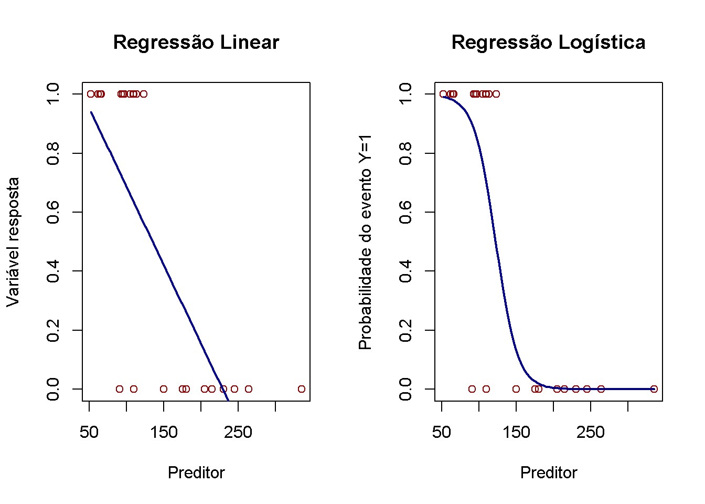
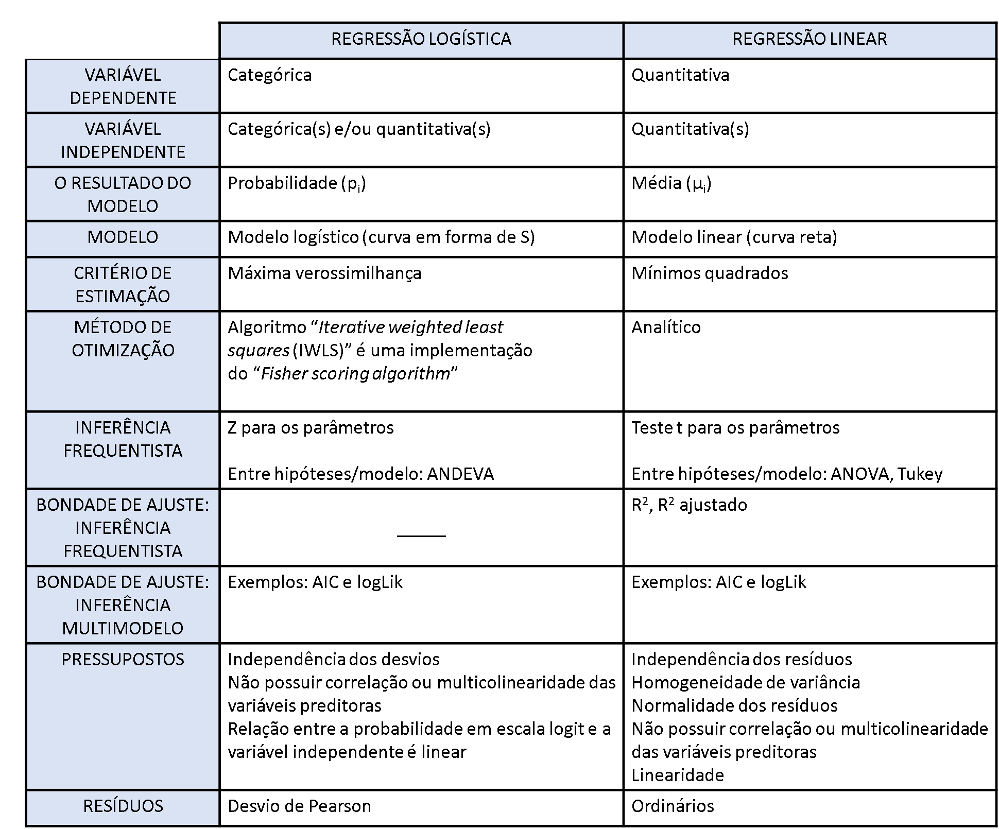

# Regressão Logística

- [Regressão logística](https://www.rpubs.com/dudubiologico/545528)
- A técnica de regressão logística é uma ferramenta estatística utilizada nas análises preditivas.
- O modelo de regressão logística é utilizado quando a variável dependente é binária, categórica ordenada ou mesmo categórica desordenada (quando não há relação hierárquica entre elas).
- Pode-se considerar a regressão logística como sendo um caso especial de regressão linear onde a variável dependente (eixo Y do gráfico) é categórica, ou seja, possuem categorias/níveis
- Na regressão logística, a variável categórica pode ser de natureza:
    - dicotômica e binária: quando a categoria estabelecida tem 2 níveis. Por exemplo: podemos classificar a visitação das flores de uma planta por abelhas em 2 níveis: planta visitadas por abelhas e planta não visitadas por abelhas. Quando as categorias são representadas por números (1: evento de interesse e 0: ausência de efeito de interesse), chamamos de variável binária
    - ordinal: quando existe uma ordenação entre 3 ou mais categorias/níveis (politômicas). Por exemplo: mês de observação dos dados coletados que podem ser janeiro, fevereiro, março…dezembro
    - nominal: quando não existe uma ordenação entre 3 ou mais categorias/níveis (politômicas). Por exemplo: a cor dos olhos que tem-se azul, preto, verde, etc.
- A regressão logística utiliza a **curva logística** para assim representar a relação entre a variável dependente e as independentes.
- Tenta encontrar a melhor linha **curva** (correlação) para encaixar os dados
- Encontra uma função que tenta predizer uma probabilidade

- Função Sigmoide - formato de S
    - Equação da reta está contida na função
    - inclui dados que ficariam fora de uma reta
- Descida de gradiente
    - Tenta encontrar o melhor parâmetro que tenha o menor erro possível
    
    
- fonte [Software R: curso avançado](https://smolski.github.io/livroavancado/)

# Linear X Logística

