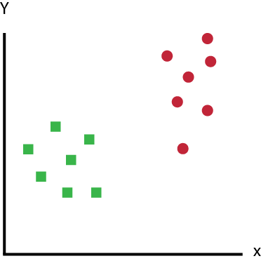
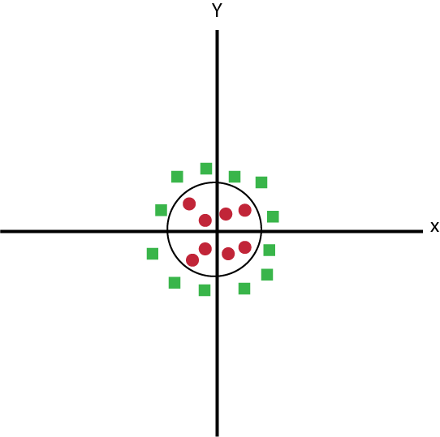

# Resumo

- Funciona para dados em várias dimensões
- Funciona para dados em com separações não-lineares
- Existem algoritmos eficientes para calcular o melhor hiperplano
    - Requer que usuário decida sobre melhores funções e parâmetros
- Dificuldade em tratar valores vazios
- Robusto a ruído
- Alto custo computacional, mas resultados muito bons

# Máquina de Vetores de Suporte

- [SVM ou Support Vector Machine](https://www.codigofluente.com.br/aula-08-scikit-learn-maquina-de-vetores-de-suporte/)
- [Algoritmo SVM (Máquina de Vetores de Suporte) a partir de exemplos e código (Python e R)](https://blogdozouza.wordpress.com/2019/04/10/algoritmo-svm-maquina-de-vetores-de-suporte-a-partir-de-exemplos-e-codigo-python-e-r/)
- **SVM ou Support Vector Machine** é um algoritmo de aprendizado de máquina supervisionado que pode ser usado para desafios de **classificação ou regressão**.



- A ideia do SVM é simples: **o algoritmo cria uma linha ou um hiperplano que separa os dados em classes**.
- Etapas do Algoritmo
    1. Na primeira aproximação, o que os SVMs fazem é encontrar uma linha de separação (ou hiperplano) entre as classes. O SVM é um algoritmo que pega os dados como uma entrada e gera uma linha que separa essas classes, se possível.
    2. Existem infinitas linhas possíveis que separam os dados
    3. Devemos encontrar os pontos mais próximos de cada hiperplano. Estes pontos, os mais próximos dos hiperplanos, são chamados de vetores de suporte. 
    
    
    
    4. o SVM tenta estabelecer um limite de decisão de tal maneira que a separação entre as duas classes seja tão ampla quanto possível.
    5. O motivo de selecionar o melhor hiper-plano, isto é, de margem máxima, é a robustez, se selecionarmos um hiperplano com margem baixa, haverá uma alta chance de falta de classificação.
- O **SVM tem um recurso para ignorar valores discrepantes** (outliers), fora da curva e encontrar o hiperplano que tem margem máxima. Portanto, podemos dizer que SVM é robusto para outliers.
- **kernel** - Estas são funções que ocupam um espaço de entrada dimensional baixo e o transformam em um espaço dimensional mais alto, isto é, ele converte um problema não separável em um problema separável, essas funções são chamadas de núcleos (kernels). **É principalmente útil no problema de separação não linear.** Ele faz algumas transformações nos dados extremamente complexas e, em seguida, descobre o processo para separar os dados com base nos rótulos ou saídas que você definiu.



- **Prós**:
    - Funciona muito bem com margem de separação clara
    - É eficaz em espaços dimensionais elevados.
    - É eficaz nos casos em que o número de dimensões é maior que o número de amostras.
    - Ele usa um subconjunto de pontos de treinamento na função de decisão (chamados de vetores de suporte), portanto, também é eficiente em termos de memória.
- **Contras**:
    - Não funciona bem quando temos um grande conjunto de dados porque o tempo de treinamento necessário é maior
    - Também não funciona muito bem, quando o conjunto de dados tem mais ruído, ou seja, as classes de destino estão sobrepostas
    - O SVM não fornece estimativas de probabilidade diretamente, elas são calculadas usando uma valiosa validação cruzada de cinco vezes. É o método SVC relacionado da biblioteca scikit-learn do Python.


```python

```
