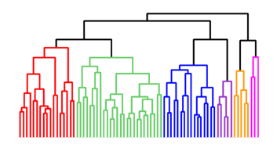

# Agrupamento

- [K-means](https://minerandodados.com.br/entenda-o-algoritmo-k-means/)
- O **clustering** ou **análise de agrupamento de dados** é o conjunto de técnicas que visam fazer agrupamentos automáticos de dados segundo o seu grau de semelhança. 
- O processo para agrupamento de dados se baseia no conceito de similaridade, ou seja, a ideia principal é encontrar itens semelhantes de acordo com seus atributos.
    - O que de fato determina a similaridade entre os registros é o **cálculo de distância**.
- Agrupamento de dados é uma técnica base para **identificar valores anômalos ou outliers**.
    - De forma, bem simples, alguns métodos fazem um agrupamento nos dados e concentram em identificar os pontos que mais se distanciam do grupo. **Aqueles que são pouco similar com os demais podem ser considerados outliers**.
- Possibilidades
    - Podemos utilizar da vantagem do agrupamento no setor comercial para identificar e segmentar perfis de clientes para uma campanha de Marketing
    - Agrupar pacientes com sintomas similares pode ser útil para identificar situações de risco em novos casos.
    - Segmentar produtos semelhantes pode ser extremamente interessante para um sistema de recomendação de produtos em um e-commerce

## Tipos de Clusters

- **Exclusive Cluster ou Grupo Exclusivo** - Se refere a um tipo de agrupamento onde os registros são exclusivos ,ou seja, cada registro pertence a um único grupo.
- **Overlapping Cluster ou Cluster Sobreposto** - Se refere a um tipo de agrupamento onde os registros podem pertencer a mais de um grupo ou cluster, diferente do Exclusive Cluster conforme já explicamos onde os registros pertencem a somente um grupo.
- **Hierarchial Cluster ou Cluster hierárquico** - Se refere a um tipo de agrupamento onde possui uma hierarquia entre os grupos. Os registros podem ser agrupados em grupos que podem conter subgrupos contendo outros registros.

# Algorítmo K-Means

- **Resumo**
- Baseado na distância Euclidiana
- Os centros dos clusters são calculados pela média aritmética de seus componentes
- **Algoritmo guloso**
    - Comece com centros de clusters arbitrários
    - Encontre o centro do cluster mais próximo para cada item, e atribua o item a esse cluster
    - Recalcule o centro dos clusters incluindo os novos membros
- **Repete**
    - por um número fixo de vezes, ou
    - até que não tenha mudança nos clusters, ou
    - até que mudanças sejam mínimas na qualidade
- **Características**
    - Requer o número pré-definido de clusters
    - Algoritmo guloso com pontos iniciais aleatórios
    - Muito simples
    - Complexidade O(NK) por iteração, onde N é o número de atributos e K o número de clusters
    - Fronteiras lineares

- **O K-means é um algoritmo do tipo não supervisionado**, ou seja, que não trabalha com dados rotulados.
- O objetivo desse algoritmo é encontrar similaridades entre os dados e agrupá-los conforme o número de cluster passado pelo argumento k.

- **Etapas do Algorítmo**
    - **Iniciação**
        - Na fase de inicialização simplesmente o algoritmo gera de forma aleatória **k centroids**, onde o número de centroids é representado ao parâmetro k.
        - Estes centroids são pontos de dados que serão utilizados, como o nome sugere, de pontos centrais dos clusters. Podemos pensar como referências que serão utilizadas para calcular a distância entre os dados e gerar os clusters.
    - **Atribuição ao Cluster**
        - Nesta etapa é calculado a distância entre todos os pontos de dados e cada um dos centroids.
        - Cada registro será atribuído ao centroid ou cluster que tem a menor distância.
        - O cálculo de distância é utilizado através da distância Euclidiana.
            - $DE(x,y) = \sqrt{\sum_{i}^{p}{(x_i - y_i)^2}}$
    - **Movimentação de Centroids**
        - Uma vez que os pontos de dados foram atribuídos aos clusters conforme sua distância, o próximo passo é recalcular o valor dos centróides.
        - Nesta etapa é calculada a média dos valores dos pontos de dados de cada cluster e o valor médio será o novo centróide.
        - O termo movimentação se refere a alteração da localização do centróide em um plano se pensarmos em um gráfico.
    - **Otimização do K-médias**
        - Podemos chamar esse algoritmo de K-médias, alias, tem gente que só conhece com esse nome. Eu prefiro K-means mesmo.
        - Na fase final da execução do K-means as fases Atribuição ao Cluster e Movimentação de Centroids são repetidas até o cluster se tornar estático ou algum critério de parada tenha sido atingido.
        - O cluster se torna estático quando nenhum dos pontos de dados alteram de cluster.
        - Um critério de parada pode ser o número de iterações máximas que o algoritmo irá fazer durante a fase de otimização.
        - Por fim o K-means chega ao fim da sua execução dividindo os dados no número de clusters especificado pelo argumento k.
        
        
        
## Melhor K 

- Ter um conhecimento prévio de quantos grupos são necessários
- Se não tiver conhecimento prévio, podemos usar 
    - Cluster = $\sqrt{\frac{N}{2}}$
    
### Eblow 

- Tenta vários valores de k
- Não existe garantia para encontrar o melhor conjunto de clusters
1. Algoritmo de clustering será executado um número finito de vezes, para diferentes valores de k. Por exemplo, variando k de 1 a 10 clusters.
2. Para cada k, calcule a soma total dentro do cluster de quadrado (wss)
    - $WCSS = \sum_{p+i in cluster}{distance(P_i, c_i)^2}$
3. Plote a curva de wss de acordo com o número de clusters k.
4. A localização de uma curva (joelho) na trama é geralmente considerada como um indicador do número adequado de aglomerados.

# [Agrupamento Hierárquico](https://smolski.github.io/livroavancado/analise-de-clusters.html#clusterizacao-aglomerativa)

- Não é necessário especificar o número de clusters
- É criada uma estrutura em formato de árvore que indica o número de clusters
- Abordagens
    - **Métodos Aglomerativos**: nesse caso, todos os elementos começam separados e vão sendo agrupados em etapas, um a um, até que tenhamos um único cluster com todos os elementos. O número ideal de clusters é escolhido dentre todas as opções.
    - **Métodos Divisivos**: no método divisivo todos os elementos começam juntos em um único cluster, e vão sendo separados um a um, até que cada elemento seja seu próprio cluster. Assim como no método aglomerativo, escolhemos o número ótimo de clusters dentre todas as possíveis combinações.
- Os resultados podem ser apresentados em um dendograma
    - O **dendrograma** (dendro = árvore) é um diagrama de árvore que exibe os grupos formados por agrupamento de observações em cada passo e em seus níveis de similaridade. 
    - **De modo geral, um bom ponto de decisão da clusterização final é onde os valores de distância mudam consideravelmente, ou seja, a distância vertical mais alta que não cruza com os clusters (sem linhas horizontais)**

- Algoritmo
    1. A inclusão inicial de casa objeto considerando um agrupamento individual
        
    2. próximo passo são formados pares de clusters com maiores similaridades entre si;
         
    3. repete-se o procedimento em novos clusters maiores, chegando até um único grande cluster
         
         
https://operdata.com.br/blog/analise-de-cluster/
https://www.monolitonimbus.com.br/analise-de-cluster/

# DBSCAN

- Density-Based Spatial Clustering of Applications withNoise
- Baseado na densidade dos pontos
    - quantidade de pontos em uma área
- Baseado em densidade, agrupando os pontos similares no mesmo espaço
- **Conceitos**
    - **Ponto núcleo**: Existe pelo menos um número específico de pontos (MinPts) próximos
    - **Ponto de fronteira**: Não é um núcleo, mas está na vizinhança de um
    - **Ponto de ruído**: Não é núcleo nem de fronteira
    
- **Não é necessário especificar o número de clusters**
- Emgeral apresenta melhores resultados que o k-means•Maisrápido que o k-means
- Tenta encontrar os pontos que são separados por uma distância não maior do que um limiar (threshold distance)
- Encontra padrões não lineares
- **Robusto contrao utliers**
- O resultado pode ser mais consistente que o k-means porque a inicialização dos 'centroides' não afeta tanto o algoritmo
- Dependendo da inicialização, um ponto pode pertencer aos cluster dependendo da ordem
- Pode ser difícil encontrar um bom valor para o parâmetro da distância
- **Algorítmo**
    1. O algoritmo prossegue captando arbitrariamente um ponto no conjunto de dados (até que todos os pontos tenham sido visitados).
    2. Se houver pelo menos pontos 'minPoint' dentro de um raio de 'ε' ao ponto, então consideramos que todos esses pontos fazem parte do mesmo cluster.
    3. Os clusters são então expandidos repetindo recursivamente o cálculo do bairro para cada ponto vizinho

 
 
## Parâmetros

- **minPts**: Como regra geral, um mínimo de minPts pode ser derivado do número de dimensões D no conjunto de dados, como minPts ≥ D + 1. 
    - **Valor Baixo, como minPts = 1, não faz sentido**, pois então cada ponto por si só já será um cluster. Com valores como minPts = 2, o resultado será o mesmo do cluster hierárquico com a métrica de elo único, com o dendrograma cortado na altura ε. Portanto, os minPts **devem ser escolhidos pelo menos 3**.
    - No entanto, **valores maiores geralmente são melhores para conjuntos de dados com ruído** e produzirão clusters mais significativos. **Como regra geral, pode ser usado minPts = 2·dim**, mas pode ser necessário escolher valores maiores para dados muito grandes, para dados barulhentos ou para dados que contenham muitas duplicatas. 
- **ε**: O valor para ε pode então ser escolhido usando um gráfico de k-distance k = minPts-1, traçando a distância até o vizinho mais próximo encomendado do maior ao menor valor. **Bons valores de ε são onde este enredo mostra um "eblow"**: se ε for escolhida muito pequena, grande parte dos dados não será agrupada; enquanto para um valor muito alto de ε, os clusters se fundirão e a maioria dos objetos estará no mesmo cluster. **Em geral, pequenos valores de ε são preferíveis, e como regra geral, apenas uma pequena fração de pontos deve estar a essa distância um do outro.** 
- **Função distância**: A escolha da função de distância está fortemente ligada à escolha de ε, e tem um grande impacto nos resultados. Em geral, será necessário primeiro identificar uma medida razoável de similaridade para o conjunto de dados, antes que o parâmetro ε possa ser escolhido. Não há estimativa para este parâmetro, mas as funções de distância precisam ser escolhidas adequadamente para o conjunto de dados.

# DBScan X KMeans

O que é bom no DBSCAN é que você não precisa especificar o número de clusters para usá-lo. Tudo o que você precisa é de uma função para calcular a distância entre os valores e alguma orientação para que quantidade de distância é considerada "próxima". O DBSCAN também produz resultados mais razoáveis do que k-significa em uma variedade de distribuições diferentes. A figura abaixo ilustra o fato:

https://www.kdnuggets.com/2020/04/dbscan-clustering-algorithm-machine-learning.html
