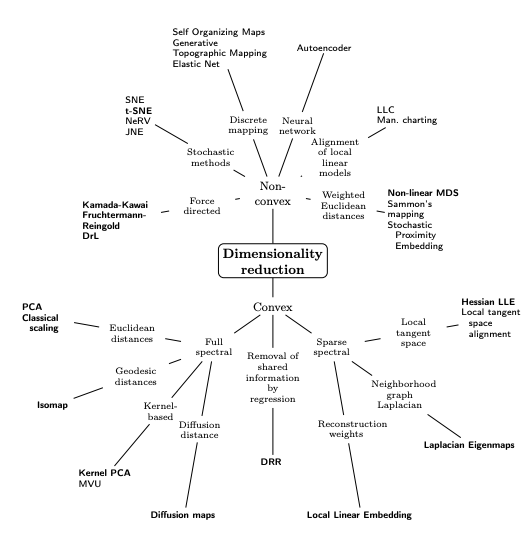
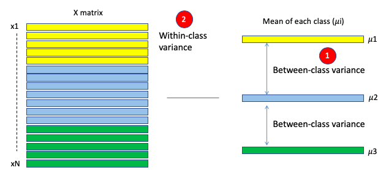

# Redução de Dimensionalidade

Com esse aumento horizontal das bases de dados (dimensões / atributos) um problema grave é o aumento da dimensionalidade (Course of Dimensionality) em que temos não somente multicolinearidade, heteroscedasticidade e autocorreção para ficar em exemplos estatísticos simples.  Em termos computacionais nem é preciso dizer que o aumento de atributos faz com que os algoritmos de Data Mining ou Inteligência Computacional tenham que processar um volume de dados muito maior (aumento da complexidade do processamento = maior custo temporal).

- Em muitos casos o conjunto de dados possuem dimensões elevadas com várias variáveis dependentes entre si. Para solucionar este problema, temos as técnicas de dimensionalidade. 
- Os métodos de redução de dimensionalidade funcionam identificando um conjuntos de variáveis não correlacionadas entre si que explicam a maior parte da variabilidade     dos dados.   
- Em termos algébricos, estamos interessados em matrizes de rank menor que permitam explicar os dados originais e reconstruí-los de forma o mais aproximada possível. 
- **A redução da dimensionalidade se refere à redução do número de variáveis de entrada para um conjunto de dados** 

## Missing Values Ratio - Proporção de valores ausentes

- **Se resume em remover colunas com um limite intolerável de valores nulos**. 
- É improvável que as colunas de dados com muitos valores ausentes contenham muitas informações úteis. 
- Assim, colunas de dados com número de valores ausentes maiores do que um determinado limite podem ser removidas. 
    - Quanto mais alto o limite, mais agressiva é a redução.

##  Low Variance Filter - Filtro de baixa variação

- **Se resume em remover colunas cujos os dados são estáticos, desproporcionais com uma porcentagem elevada de um único dado, ou com poucas mudanças**
- As colunas de dados com pequenas mudanças nos dados carregam poucas informações.
- Assim, todas as colunas de dados com variação inferior a um determinado limite são removidas. 
    - Uma palavra de cautela: a variância depende do intervalo; portanto, a normalização é necessária antes de aplicar esta técnica.
    
## High Correlation Filter - Filtro de alta correlação

- **Se resume remover colunas que possuem informações semelhantes, e para saber disto precisamos calcular o coeficiente de correlação e remover as colunas dado um limite**
- As colunas de dados com tendências muito semelhantes também podem conter informações muito semelhantes. 
- Nesse caso, apenas um deles será suficiente para alimentar o modelo de aprendizado de máquina. 
- Aqui, calculamos o coeficiente de correlação entre as colunas numéricas e entre as colunas nominais como o coeficiente do momento do produto de Pearson e o valor do qui quadrado de Pearson, respectivamente. Pares de colunas com coeficiente de correlação superior a um limite são reduzidos a apenas um.
    - Uma palavra de cautela: a correlação é sensível à escala; portanto, a normalização da coluna é necessária para uma comparação de correlação significativa.
    
##  Random Forests/Ensemble Trees

- **Se resume em criar várias árvores com baixa profundidade e encontrar quais são os atributos mais comuns nas partes superiores**
- Os conjuntos de árvores de decisão, também chamados de florestas aleatórias, são úteis para a seleção de recursos, além de serem classificadores eficazes.
- Uma abordagem para a redução da dimensionalidade é gerar um conjunto grande e cuidadosamente construído de árvores em relação a um atributo de destino e, em seguida, usar as estatísticas de uso de cada atributo para encontrar o subconjunto de recursos mais informativo. 
- Especificamente, podemos gerar um grande conjunto (2000) de árvores muito rasas (2 níveis), com cada árvore sendo treinada em uma pequena fração (3) do número total de atributos. Se um atributo é frequentemente selecionado como a melhor divisão, é mais provável que seja um recurso informativo a ser mantido. 
    - Uma pontuação calculada nas estatísticas de uso de atributo na floresta aleatória nos diz - em relação aos outros atributos - quais são os atributos mais preditivos.

## Principal Component Analysis (PCA)

- Análise de componentes principais
- **Se resume em identificar a correlação entre variáveis, e caso haja uma forte correlação é possível reduzir a dimensionalidade**.
- Das $m$ variáveis independentes, PCA extrai $p <= m$ novas variáveis independentes que explica melhor a variação na base de dados, sem considerar a variável dependente
    - O usuário pode escolher o número de $p$
- **É um método de aprendizagem não supervisionado**
- É procedimento estatístico que transforma ortogonalmente as n coordenadas originais de um conjunto de dados em um novo conjunto de n coordenadas chamadas de componentes principais. Como resultado da transformação, o primeiro componente principal tem a maior variância possível.
    - Cada componente subsequente tem a maior variação possível sob a restrição de que é ortogonal (ou seja, não correlacionado com) os componentes anteriores. Manter apenas os primeiros $m < n$ componentes reduz a dimensionalidade dos dados enquanto retém a maior parte das informações dos dados, ou seja, a variação nos dados. Observe que a transformação PCA é sensível ao escalonamento relativo das variáveis originais. 
    - Os intervalos da coluna de dados precisam ser normalizados antes de aplicar o PCA. Observe também que as novas coordenadas (PCs) não são mais variáveis reais produzidas pelo sistema. 
    - **Aplicar o PCA ao seu conjunto de dados perde sua interpretabilidade. Se a interpretabilidade dos resultados for importante para sua análise, o PCA não é a transformação de seu projeto.**
- **KernelPCA** é uma versão do PCA que os dados são mapeados para uma dimensão maior usando o kerneltrick
    - Os componentes principais são extraídos dos dados com dimensionalidade maior
    
## Linear DiscriminantAnalysis (LDA)

- Análise Discriminante Linear
- **LDA é um tipo de técnica de aprendizagem supervisionada**.
- Ele utiliza as classes na variável dependente para dividir o espaço de preditores em regiões . Todas as regiões devem ter limites lineares . Daí vem o nome linear . O modelo prevê que todas as observações dentro de uma região pertencem à mesma classe da variável dependente.
- **Além de encontrar os componentes principais, LDA também encontra os eixos que maximizam a separação entre múltiplas classes**
- Das $m$ variáveis independentes, LDA extrai $p <= m$ novas variáveis independentes que mais separam as classes da variável dependente
- **Etapas**
    1. Primeiramente, ele calcula a separabilidade entre diferentes classes da variável dependente, que é chamada de variância entre classes, conforme mostrado em (1) da Figura LDA. 
    2. Em segundo lugar, ele calcula a distância entre a média e as amostras de cada classe, que é chamada de variância dentro da classe, conforme mostrado em (2).
    3.  Em seguida, ele constrói o espaço dimensional inferior com este critério: maximizar a variância entre as classes e minimizar a variância dentro das classes. A solução para este critério é calcular os autovalores e autovetores. 
        - Os autovetores resultantes representam as direções do novo espaço e os autovalores correspondentes representam o comprimento dos autovetores.
        - Assim, cada autovetor representa um eixo do espaço LDA, e o autovalor representa o comprimento desse autovetor.
        
        

## Backward Feature Elimination - Eliminação de recursos para trás

- **Se resume em rodar um modelo várias vezes, mas com uma entrada a menos até encontrarmos o menor error possível e então removemos a entrada. O processo se repete até um limite tolerável.**
- Nesta técnica, em uma dada iteração, o algoritmo de classificação selecionado é treinado em n recursos de entrada. 
- Em seguida, removemos um recurso de entrada por vez e treinamos o mesmo modelo em n-1 recursos de entrada n vezes.
    - O recurso de entrada cuja remoção produziu o menor aumento na taxa de erro é removido, deixando-nos com n-1 recursos de entrada.
    - A classificação é então repetida usando n-2 recursos e assim por diante. 
    - Cada iteração k produz um modelo treinado em recursos n-k e uma taxa de erro e (k). 
    - Selecionando a taxa de erro máxima tolerável, definimos o menor número de recursos necessários para alcançar esse desempenho de classificação com o algoritmo de aprendizado de máquina selecionado.

## Forward Feature Construction - Construção de recursos para frente

- **Se resume em criar um modelo para cada uma das entradas, adicionando progressivamente 1 recurso por vez, selecionando aquele que obtiver o maior aumento.**
- Começamos com apenas 1 recurso, adicionando progressivamente 1 recurso por vez, ou seja, o recurso que produz o maior aumento no desempenho. 
- Ambos os algoritmos, **Backward Feature Elimination e Forward Feature Construction, são bastante demorados e caros** do ponto de vista computacional. Eles são praticamente aplicáveis apenas a um conjunto de dados com um número já relativamente baixo de colunas de entrada. 

## SVD

- SVD é um método de resumo de dados semelhante ao PCA. Ele extrai recursos importantes dos dados. 
- Mas há mais uma vantagem do SVD: reconstruir o conjunto de dados original em um pequeno conjunto de dados.
    - Portanto, ele tem amplas aplicações, como compressão de imagens. Por exemplo, se você tiver uma imagem de 32 * 32 = 1.024 pixels, SVD pode resumi-la em 66 pixels. Os 66 pixels podem recuperar imagens de 32 * 32 pixels sem perder nenhuma informação importante.
    
## t-SNE

- É um algoritmo de aprendizado de máquina para visualização que apresenta a incorporação de dados de alta dimensão em um espaço de baixa dimensão de duas ou três dimensões.
- Intuitivamente, queremos 'desenrolar' o pão suíço até virar um bolo achatado.
    - Em matemática, **significa que pontos semelhantes se tornarão pontos próximos e pontos diferentes se tornarão pontos de distância**.
- É uma técnica de redução de dimensão não linear bem adequada para incorporar dados de alta dimensão para visualização em um espaço de baixa dimensão de duas ou três dimensões. Especificamente, ele modela cada objeto de alta dimensão por um ponto bidimensional ou tridimensional de tal forma que objetos semelhantes são modelados por pontos próximos e objetos diferentes são modelados por pontos distantes com alta probabilidade. 
- **A principal aplicação do t-SNE é para visualização de grande quantidade de dados, pois pode recuperar clusters bem separados**. 
- **vantagens**
- Recupera clusters bem separados
- Persevera as regiões locais
- Sem aglomeração de observações
- **Desvantagens**
    - Estocástico, então, a menos que você defina uma semente, seus resultados não são reproduzíveis
    - Computacionalmente caro com um número extremamente grande de observações
    - Um parâmetro que pode ser muito influente
    - Pode produzir artefatos 

https://www.brutalk.com/da/brutalk-blog/view/analise-de-componentes-principais-para-reducao-de-dimensionalidade-em-python-6046cc8d2cee9

http://darwin.di.uminho.pt/cursoAnaliseDados/sessao4-apontamentos.pdf

https://ichi.pro/pt/tecnicas-de-reducao-de-dimensao-com-python-267647983853148

https://brunogolfette.com.br/artigos/algoritmos-de-reducao-de-dimensionalidade/

https://www.kaggle.com/educfrio/redu-o-de-dimensionalidade