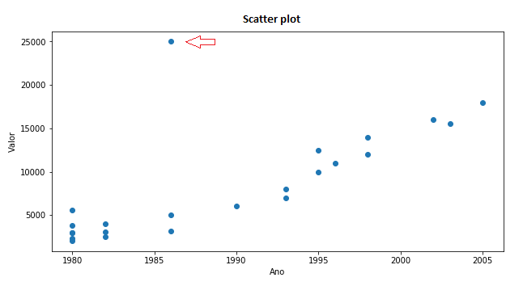
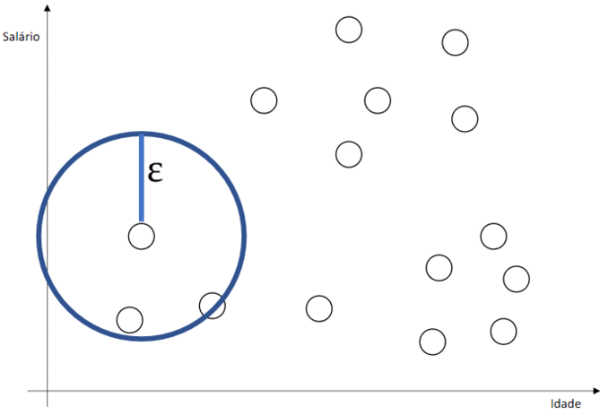

# Detecção de Outliers

- Um outlier é uma observação que se diferencia tanto das demais observações que levanta suspeitas de que aquela observação foi gerada por um mecanismo distinto (Hawkins, 1980).

## Tipos de Outliers

- **Univariados** - É detectado ao se analisar a distribuição de uma variável simples
- **Multivariados** - É detectado em espaço “n-dimensional”. Para sua observação deve-se recorrer à distribuições multidimensionais.

## Causas

- **outliers naturais** como alguém realmente ter 120 anos de idade.
- **outliers artificiais** - (erro)
    - **Erro de amostragem**: ao avaliar a média nas notas em física, normalmente baixas, algumas notas de educação física foram incluídas.
    - **Erro ao processar dados**: ao fazer o pré-processamento dos dados pode-se utilizar algum método que crie um outlier.
    - **Erro na entrada de dados**: erros de digitação ou coleta de informações.
    - **Erro de medida**: são os mais comuns. Instrumentos danificados ou usados de forma incorreta são fontes constantes de outliers.
    - **Erro intencional**: ao verificar-se a quantidade de álcool ingerida na última semana em uma classe de jovens, a maior parte intencionalmente, fornece valores abaixo dos reais. Dessa forma, um jovem que fornece os valores reais aparecerá como um outlier.
    
## Efeitos

- Um outliers podem alterar significativamente as medidas estatísticas como a média, o erro absoluto, etc. 
- Outliers podem causar efeitos negativos no reconhecimento dos algorítimos que usam estas medidas estatísticas, como a regressão linear. 

## Detecção

### Box-Plot

- Mostra de forma consolidada a distribuição dos dados
- Podem ser usados para comparar atributos

### Gráfico de Dispersão

- Os diagramas de dispersão ou gráficos de dispersão são representações de dados de duas (tipicamente) ou mais variáveis que são organizadas em um gráfico.

### Quartil

- O quartil pode ser entendido como uma generalização da mediana. O quartil é o valor abaixo do qual está um certo percentual dos dados. No caso da mediana, esse percentual é de 50%. 
- Podemos ver os limites interquartis para analisar e identificar os outliers

### DBScan

- O método da DBSCAN encontra clusters baseado na densidade de observações em determinada região, ou seja, quanto maior o aglomerado de observação juntas, mais provável que elas façam parte de um mesmo subgrupo. 
- Dessa forma, todas as observações que estão separadas das demais podem ser consideradas Outliers. Isso também resulta em o DBSCAN ser um ótimo método para encontrar grupos de Outliers

### Filtro hampel

- Outro método, conhecido como filtro Hampel, consiste em considerar como outliers os valores fora do intervalo (eu) formado pela mediana, mais ou menos 3 desvios absolutos medianos.

$$eu = [ median(x) - |3 * std(x)| ; median(x) + |3 * std(x)|]$$

### Testes Estatísticos

Observe que os 3 testes são apropriados apenas quando os dados (sem exceto) são aproximadamente distribuídos normalmente. Assim, o pressuposto de normalidade deve ser verificado antes de aplicar esses testes para outliers

#### Teste de Grubbs

- O teste Grubbs permite detectar se o maior ou menor valor em um conjunto de dados é um outlier.
- O teste grubbs detecta um outlier de cada vez (maior ou menor valor), de modo que as hipóteses nulas e alternativas são as seguintes, se quisermos testar o maior valor:
    - H0: O maior valor não é um outlier
    - H1: O maior valor é um outlier
- Ou, se quisermos testar o menor valor:
    - H0: O menor valor não é um outlier
    - H1: O menor valor é um outlier
- Quanto a qualquer teste estatístico, se o valor p for menor que o limiar de significância escolhido (geralmente α=0.05), então a hipótese nula é rejeitada e concluiremos que o menor/maior valor é um outlier. Pelo contrário, se o valor p for maior ou igual ao nível de significância, a hipótese nula não é rejeitada, e concluiremos que, com base nos dados, não rejeitamos a hipótese de que o menor/maior valor não é um outlier. Observe que o teste grubbs não é apropriado para tamanho amostral de 6 ou menos (n≤6)

#### Teste de Dixon

- Semelhante ao teste de Grubbs, o teste de Dixon é usado para testar se um único valor baixo ou alto é um outlier. Portanto, se mais de um outliers é suspeito, o teste tem que ser realizado nestes suspeitos outliers individualmente.
- Observe que o teste de Dixon é mais útil para o tamanho da amostra pequena (geralmente n ≤ 25).

#### Teste de Rosner

- O teste de Rosner para outliers tem as vantagens que:
    - É usado para detectar vários outliers ao mesmo tempo (ao contrário do teste de Grubbs e Dixon, que deve ser realizado iterativamente para tela para vários outliers), e
    - É projetado para evitar o problema da mascaramento, onde um outlier que está perto em valor para outro outlier pode passar despercebido.
- Ao contrário do teste de Dixon, note que o teste de Rosner é mais apropriado quando o tamanho da amostra é grande (n ≥ 20).

## Tratamento dos Outliers

- Devemos lembrar que o outlier pode ser objeto de nossa procura. Pode ser aquela compra fora dos padrões que indicará que o cartão de créditos foi clonado. Pode ser o valor a indicar uma nova solução para antigos problemas.
- **Eliminar o valor**: se nosso conjunto de dados é grande o suficiente, poderemos simplesmente deletar os valores anômalos sem maiores prejuízos para a análise.
- **Transformação logarítmica**: a transformação logarítmica dos dados pode reduzir a variação causada por valores extremos.
- **Filtragem de dados**: alguns filtros podem ser utilizados, como o média-móvel.
- **Tratamento separado**: se a quantidade de outliers é significante, podemos tratá-los separadamente. Podemos separar os valores em dois grupos e criar modelos individuais.
- 

https://medium.com/ensina-ai/outlier-o-ponto-fora-da-curva-1f28f3d9c23

https://statsandr.com/blog/outliers-detection-in-r/
