https://inside.contabilizei.com.br/ci%C3%AAncia-da-computa%C3%A7%C3%A3o-na-pr%C3%A1tica-parte-1-a6f0586c43fd

# Grafos

- **Grafo** é uma estrutura de abstração, na representação e solução de diversos tipos de problemas. 
- Matematicamente, um grafo é representado da seguinte maneira $G = (V, E)$
    - **G** é um par $(V, E)$
    - **V** é um conjunto de **vértices** (representado graficamente como pontos ou círculos) tal que $V = \{V_0, V_1, V_2, ..., V_n\}$
    - **E** é um conjunto de **arestas** (representado graficamente por traços ou setas) que ligam esses vértices, tal que $E = \{(V_0, V_1), (V_1, V_2), ..., (V_n, V_n+1)\}$

## Grafo Orientado ou Direcionado

- São grafos em que o **sentido** das ligações entre os vértices é **importante**. 
- Assim, as arestas possuem uma seta indicando o sentido e recebem o nome de arcos. 

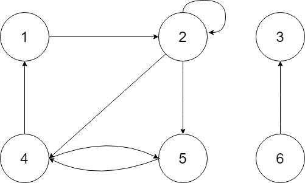

## Grafo Não-Orientado

- São grafos em que o **sentido** das ligações entre os vértices **não são importantes**. 
- Assim, as arestas possuem uma traço indicando a ligação.

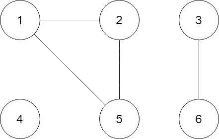

## Grafo Misto

- São grafos que possuem arcos e arestas
- Todos os grafos mistos podem ser decompostos em grafos direcionados, onde as arestas podem ser substituídas por dois arcos de sentidos contrários. 

## Diferenciação entre arestas e arcos

- Arcos são representados como (1,2), separado por vírgulas
- Arestas são representadas como (1-2), separado por traço.

# Conceitos

- **Laço** - Uma aresta que liga um vértice a ele mesmo
    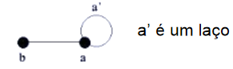
- **Arestas Paralelas** - Arestas que representam ligações diferentes entre vértices idênticos. 
- **Grafo Simples** - Que não contém laços ou arestas paralelas.
    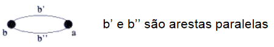
- **Pseudografo** - Que possui pelo menos um laço
- **Multigrafo** - Grafo não direcionado que possui no mínimo duas arestas
- **Multigrafodirecionado** - Que possui dois ou mais arcos de mesma direção ligando um mesmo par de arestas.
- **Grafo Reflexivo** - Todos os vértices possuem um laço
- **Gráfo Vazio** - Têm apenas um vértice
    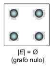
- **Grafo Nulo** - Não tem vértices
- **Grafo trivial** - Possui somente um vértice
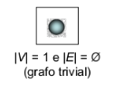
- **Hipergrafo** - Uma ou mais arestas correspondem ás relações que envolvem mais de dois vértices
- **Grafo Rotulado** - É rotulado se existem atribuições associadas a suas arestas ou vértices (numérico ou alfabético).
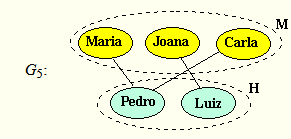
- **Grafo Ponderado** - É ponderado se existem valores numéricos associados ás suas arestas ou vértices. 
- **Ordem** - É a cardinalidade de seu conjunto de vértices, isto é N. $V(G)$ indica o número de vértices de G. 
- **tamanho** - É a cardinalidade do seu conjunto de arestas, isto é M. $E(G)$ indica o número de arestas de G.
- **Adjacentes** - 
    - **Duas arestas** são adjacentes quando compartilham um vértice. 
    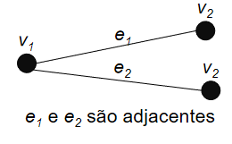
    - **Dois vértices** i e j são vizinho ou adjacentes quando existe uma aresta que liga i à j ou vice-versa. 
    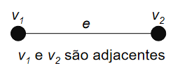
- **Sucessor** - Um vertice j é sucessor de i se existe pelo menos um arco ligando i à j. Caso contrário, j à i, então chama-se antecessor.
- **Alcançabilidade** - Um vértice w é alcançável a partir de outro v em um grafo G, quando existir em G uma sequência de sucessores começando em V e terminando em w. 
- **Passeio** - É uma sequência finita de vértices e arestas, $X_0, X_1, ... , X_k$ começando e terminando com vértices.
    - ABERTO - Um passeio é dito aberto quando $X_0$ é diferente de $X_k$, caso contrário é dito passeio fechado. 
- **Cadeia** - Ou trilha, é um passeio **sem repetição de arestas**, podendo repetir vértices. 
- **Caminho** - É um passeio **sem repetição de vértices**, consequentemente, sem repetição de arestas; 
- **Comprimento** 
    - **não ponderado** - É o número de arestas desse caminho
    - **ponderado** - É a soma dos pesos das areas desse caminho.
- **Distância** - Dado um par de vértices, a distância $d(x_i, x_j)$, corresponde ao **caminho de menor comprimento** capaz de ligar $x_i$ à $x_j$. Caso não exista, então $d=infinito$
- **Índice de Wiener** - É a soma das distâncias entre todos os pares de vértices  $x_i$, $x_j \in N$.
    $$WG = \frac{1}{2}\sum_i{\sum_j{d(x_i, x_j)}}$$
- **Ciclo** - É um caminho fechado
    - Em grafo orientado é denominado de **circuito** a sequência de arcos distintos que repete somente o primeiro e o último nó visitado. 
    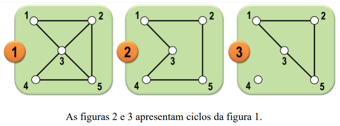
- **Corda** - É uma aresta não pertencente ao ciclo que une dois vértices não consecutivos em um ciclo. 
    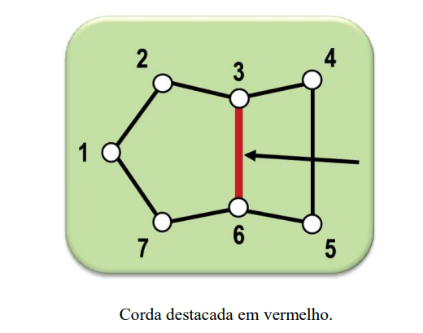
- **Cintura** de G , representada por g(G), é o comprimento do menor ciclo de G.
- **Circunferência** de G, representada por c(G), é o comprimento do maior ciclo de G.
    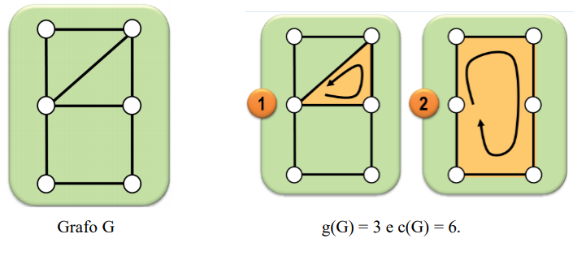
- **Excentricidade**, Ex(v) de um vértice v ∈ N é a maior distância entre v e w para todo w ∈ N.Lembre-se que distância é o caminho de menor comprimento.
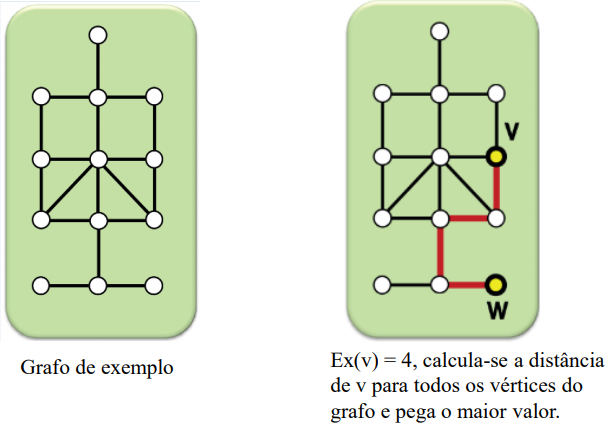
- **Raio** de um grafo G, Rad(G), é o menor valor de excentricidade para todo vértice v ∈ N.
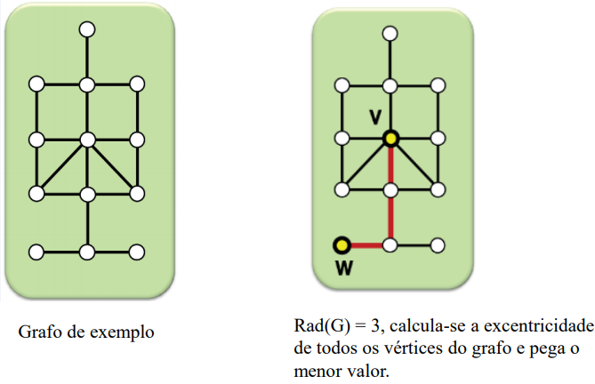
- **Diâmetro** de um grafo G, Diam(G), é o maior valor de excentricidade para todo vértice v ∈ N
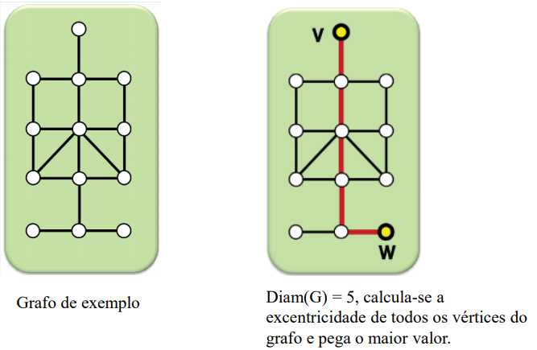
- **Centro** de um grafo G, Centro(G), é o subconjunto dos vértices de excentricidade mínima.
- **Grau** $d(x_i)$ (ou valência)
    - **Grau Interno** - $d^-(X_i)$ é igual ao número de arcos incidentes ao vértice, ou seja, aqueles que apontam para o vértice
    - **Grau Externo** - $d^+(X_i)$ é igual ao número de arcos emergentes ao vértice, ou seja, aqueles que deixam o vértice. 
    - Assim, o grau de um vértice é: $d(X_i) = d^-(X_i) + d^+(X_i)$
    - **Não direcionado (1)** - O grau de um vértice $x_i$ em um grafo não direcionado é igual ao número de arestas incidentes no vértice.
        - OBs: Aresta do laço conta duas vezes.
    - **Direcionado (2)** - No caso de grafos direcionados o cálculo do grau de um vértice xi é composto por um valor interno $d^-(x_i)$ (que apontam para o vértice) e um externo $d^+(x_i)$ (que deixam o vértice).
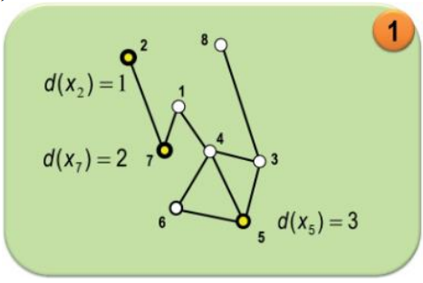
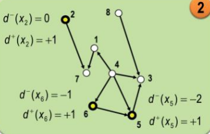
- **Handshaking Lemma** - Em qualquer grafo, o número de vértices de grau ímpar é par. Ou seja, em qualquer grafo, o somatório dos graus, de todos os vértices é igual ao dobro do número de arestas. 
$$\sum{d(x) = 2m}$$
- **Par** - G é dito par, se todos os seus vértices possuírem grau par. Não existe G ímpar. 
- **Conexo** - é um grafo G, onde para todo par de vértices i e j existe pelo menos um caminho entre i e j, 
- **Supergrafo** - Se G' é um subgrafo de G, então G também pode ser denominado supergrafo de G'
- **Grafo Completo** - é dito completo se exite uma aresta associada a cada par de vértices de G
    - No caso de Orientado, isso significa, a existência de um arco para cada par orientado de vértices. 
- **Torneio** - é quando cada par de vértices em G é ligado exatamente por um arco. Em outras palavras, um grafo completo e direcionado é determinado torneio. 
- **Grafo Planar** - G é planar se seus vertices e arestas podem ser rearranjados tal que suas arestas não se cortem ou cruzem .
- **Isomorfismo** - Dois grafos $G_1 = (N_1,M_1)$ E $G_2 = (N_2,M_2)$ são isomorfos se existe uma função unívoca $F:N_1->N_2$ tal que $(i,j)$ é um elemento de $M_1$ se e somente se $(f(i), f(j))$ for um elemento de $M_2$.
    - Características
        - Possuem a mesma sequência de graus
        - Não são isomorfos se um deles contém um subgrafo não pertencente ao outro

**************************************************

# Estrutura de Dados para Grafos

## Matriz de Adjacência

- É uma matriz $A(G) = [a_{ij}]$ de ordem n é denominada matriz de adjacência de um grafo $G = (N,M)$ quando
    - $a_{ij} = 1, se \exists(i,j) \epsilon M$
    - $a_{ij} = 0, caso contrário$ 
- Em outras palavras, trata-se de uma matriz que associa cada linha a cada coluna a um vértice, sendo que os valores nulos estão associados à ausência de ligações e valores não-nulos estão associados à presença de arcos ou arestas. 
    - Características
        - É simétrica para grafos não direcionados
        - Valor diferente de zero na diagonal principal representa um laço.
        - Consulta a existência de arco/aresta com um único acesso à memória. 

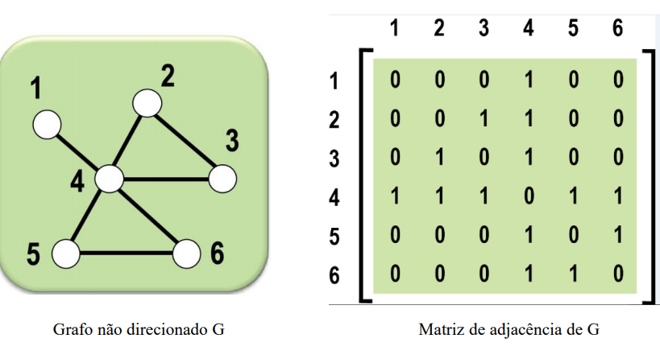

### Matriz de pesos

- Quando um grafo é ponderado ou valorado podemos representar esses pesos na matriz de adjacência. Basta substituir os elementos "1s" pelos pesos da aresta associado. 

---------------------------------------

## Matriz de Incidência - Não orientado

- É uma matriz $A(G) = [A_{ki}]$ de dimensão $mxn$, onde é denominada matriz de Incidência de um $G=(N,M)$ quando:
    - $a_{ij} = 1$, se a aresta K incide no vértice P
    - $a_{ij} = 0$, caso contrário 
    
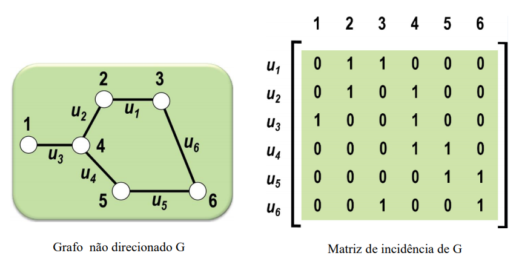

## Matriz de Incidência - Orientado

- É uma matriz $A(G) = [A_{ki}]$ de dimensão $mxn$, onde é denominada matriz de Incidência de um $G=(N,M)$ quando:
    - $a_{ij} = 1$, se o arco  $u_K$ tem origem no vértice i
    - $a_{ij} = -1$, se i é o vértice de destino do arco $u_K$
    - $a_{ij} = 0$, se o arco $u_K$ não incide no vértice i. 
    
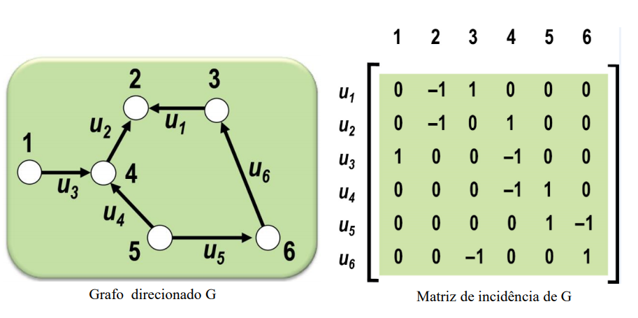

--------------------------

## Lista de Adjacência

- É composta por um vetor v de dimensão n
- Cada elemento de v contém dois campos: 
    - A identificação de um vértice
    - Um ponteiro para um lista encadeada contendo os vizinhos do vértice correspondente
- A identificação pode ser omitida caso o vértice seja associado ao índice do vetor

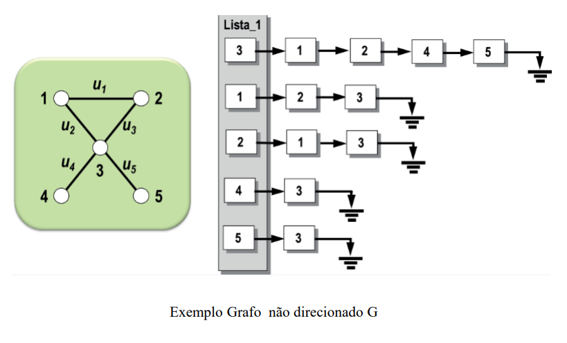

- No caso de **grafo direcionado**, a lista encadeada correspondente a um vértice i é composta pelos vértices j, tais que existe uma aresta com origem no vértice i e destino no vértice j.

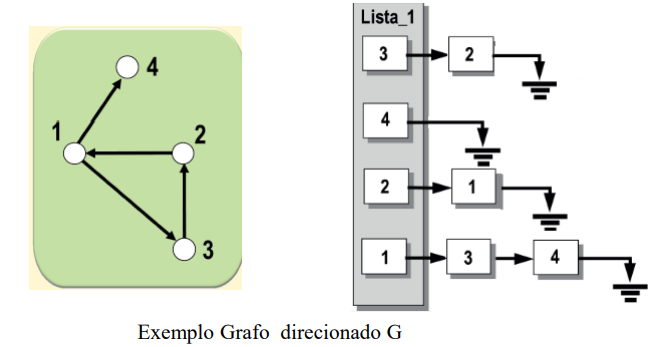

-----------------------------

## Representação Vetorial

- Utiliza dois vetores, V e W, com dimensões n e m, respectivamente
- Cada elemento i do vetor V regista o grau do vértice i
- Os elementos de w correspondem aos vizinhos dos vértices representados em V

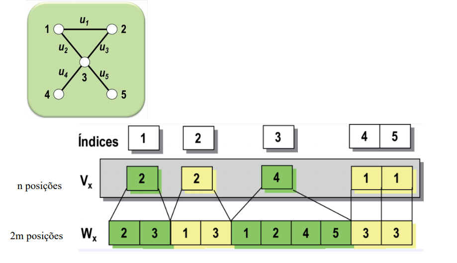

    